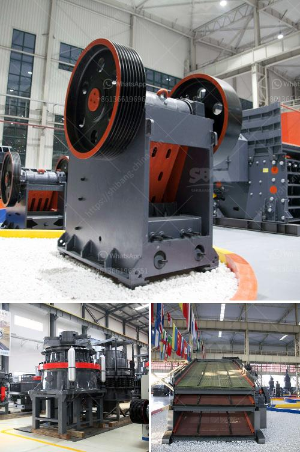

<h3>lancaster building supply in vryheid</h3>
Located in the beautiful town of Vryheid, Lancashire, Lancaster Building Supply has emerged as a one-stop solution for all construction needs in the region. With a wide range of products and exceptional customer service, they have become a trusted name amongst builders, contractors, and homeowners alike.

Lancaster Building Supply prides itself on offering high-quality building materials and tools that meet the diverse requirements of its customers. They understand the importance of using reliable materials that can withstand the test of time and harsh weather conditions, ensuring the longevity and durability of any project. From bricks to cement, electrical fittings to plumbing supplies, Lancaster Building Supply stocks it all.

One of the key aspects that sets Lancaster apart from its competitors is their commitment to understanding the specific needs of each customer. Whether you are a professional contractor working on a large-scale project or a homeowner planning a small renovation, the friendly and knowledgeable staff at Lancaster guides you through the entire process, offering expert advice and assistance. They take the time to understand your project and provide tailored recommendations, ensuring you find the best products for your requirements.

In addition to their extensive product range, Lancaster Building Supply also offers a convenient delivery service. Recognizing the time constraints faced by builders and contractors, they aim to reduce the hassle of transportation and logistics. With prompt and reliable delivery, your materials arrive at your doorstep, saving you valuable time and allowing you to focus on the job at hand.

Another impressive aspect of Lancaster Building Supply is their dedication to sustainability. They understand the importance of environmentally friendly practices, and thus offer a range of eco-friendly options for customers who prioritize sustainability. Whether it is recycled materials or energy-efficient products, Lancaster ensures that you have access to sustainable choices that align with your values.

Furthermore, Lancaster Building Supply understands that building projects can sometimes be costly. With this in mind, they strive to provide competitive prices while never compromising on quality. Their commitment to offering affordable products ensures that you can complete your projects within budget without sacrificing the standard of materials used.

The success of Lancaster Building Supply can be attributed to its strong relationships with both suppliers and customers. With well-established connections to reputable manufacturers and distributors, they can guarantee the quality and reliability of their products. Their ever-growing list of satisfied customers speaks volumes about the level of trust and satisfaction that Lancaster delivers.

In conclusion, Lancaster Building Supply has become the go-to destination for builders, contractors, and homeowners in Vryheid. Offering a vast range of building materials, exceptional customer service, convenient delivery options, and a commitment to sustainability, they have earned their reputation as a reliable and customer-focused business. With Lancaster Building Supply, construction projects in Vryheid are made easier, cheaper, and more efficient, ensuring the success of each endeavor.
<h3>Contact us</h3><ul><li><strong>Whatsapp:&nbsp;<a href="https://wa.me/8613661969651">+8613661969651</a></strong></li><li><a href="https://swt.shibang-china.com/?git&amp;zhl&amp;lancaster building supply in vryheid"><strong>Online Service(chat now)</strong></a></li></ul><h3>Related</h3><ul><li><a href='mobile iron ore crusher.md'>mobile iron ore crusher</a></li><li><a href='buy new bal mill.md'>buy new bal mill</a></li><li><a href='hammer mill edipesa.md'>hammer mill edipesa</a></li><li><a href='gold processing company china.md'>gold processing company china</a></li><li><a href='mini concrete crushers for sale in america.md'>mini concrete crushers for sale in america</a></li></ul>