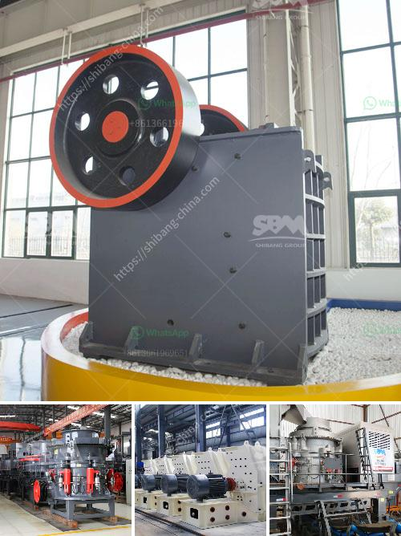

<h3>large scale gold mining equipment for sale</h3>
When it comes to gold mining, traditional methods can only take you so far. Finding an abundant gold reserve requires advanced equipment that can handle large-scale mining operations. That is where large-scale gold mining equipment comes into play.

Large-scale gold mining equipment is designed specifically for working efficiently and effectively on big mining operations. With years of research and development, these machines have been designed to tackle various mining challenges head-on. From open-pit to underground mining, this equipment is built to handle it all.

One of the key advantages of large-scale gold mining equipment is its ability to extract and process a considerable amount of ore in a short period. These machines are often equipped with high-capacity motors and powerful mechanisms to ensure maximum productivity. They can not only extract the gold ore but also crush and refine it, making it ready for commercial use.

Moreover, large-scale gold mining equipment offers increased safety and reliability. These machines are built sturdily with reinforced structures and enhanced safety features to minimize accidents and ensure workplace safety. Additionally, they are equipped with the latest technologies like remote monitoring and advanced control systems, making them easy to operate and maintain.

For businesses looking to invest in large-scale gold mining equipment, there are various options available. From jaw crushers and cone crushers to trommels and shaker tables, these machines can be customized to meet specific mining requirements. Plus, there is a range of sizes to choose from, ensuring suitability for projects of different scales.

In conclusion, large-scale gold mining equipment is the backbone of modern mining operations. It offers efficient ore extraction, processing, and refinement, maximizing productivity while ensuring safety and reliability. Investing in such equipment can open up possibilities for substantial returns in the gold mining industry. So, whether you are a seasoned miner or an aspiring one, consider the benefits of large-scale gold mining equipment when looking for a profitable endeavor.
<h3>Contact us</h3><ul><li><strong>Whatsapp:&nbsp;<a href="https://wa.me/8613661969651">+8613661969651</a></strong></li><li><a href="https://swt.shibang-china.com/?git&amp;zhl&amp;large scale gold mining equipment for sale"><strong>Online Service(chat now)</strong></a></li></ul><h3>Related</h3><ul><li><a href='industrial jaw crushers.md'>industrial jaw crushers</a></li><li><a href='used crusher stone sale tanzania.md'>used crusher stone sale tanzania</a></li><li><a href='cs series cone crusher.md'>cs series cone crusher</a></li><li><a href='dolomite processing plant.md'>dolomite processing plant</a></li><li><a href='friendly gold mining equipment.md'>friendly gold mining equipment</a></li></ul>