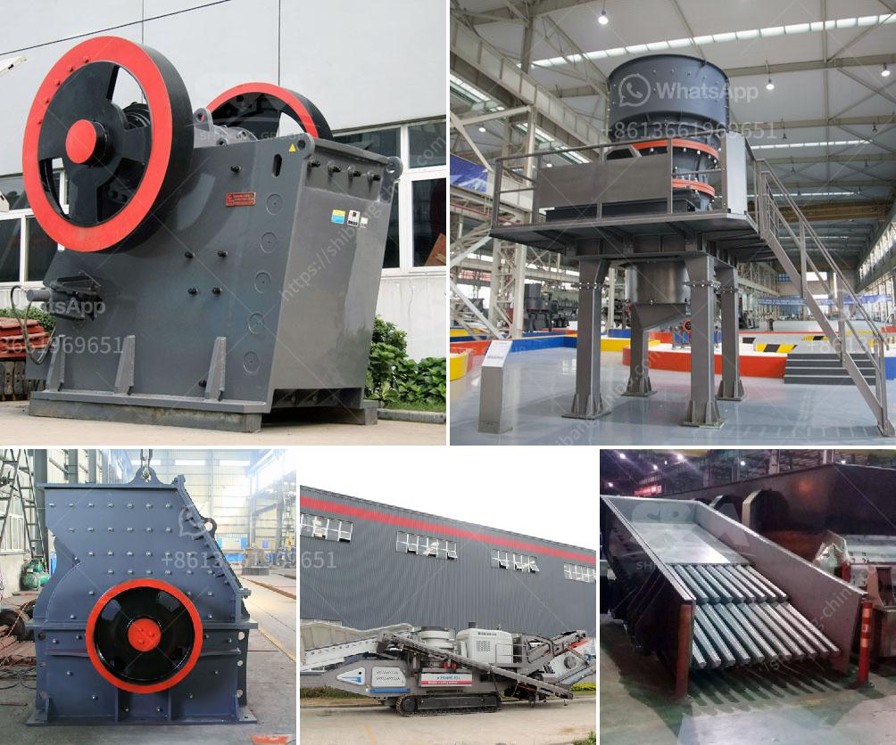

<h3>latest chrome crush and wash plant for sale in rsa</h3>
The chrome crushing and washing plant for sale in RSA (Republic of South Africa) is a popular topic in the mining industry. With the rapid development of infrastructure and urbanization in South Africa, the chrome ore market is also expanding rapidly. In recent years, the production and export volume of chrome ore have both increased significantly, which drives the demand for chrome processing equipment like crushing and washing plants.

These plants are crucial in the process of extracting chrome ore from its natural form and making it suitable for various industrial uses. The chrome crushing plant is responsible for reducing the size of the extracted chrome ore and making it suitable for further processing. This process involves using standard crushing machines to break down the large chunks of ore into smaller, manageable pieces.

Once the ore has been crushed, it is then sent to the washing plant for further processing. The chrome washing plant is responsible for removing impurities such as dirt, dust, and other unwanted substances from the chrome ore. This cleaning process ensures that only pure chrome ore is sent for further processing and trading.

The latest chrome crush and wash plants for sale in RSA are equipped with advanced technology and machinery to ensure efficient and effective chrome ore processing. These plants are designed to handle large quantities of chrome ore and process them quickly and accurately. They are equipped with heavy-duty crushers, screens, and washing equipment to achieve the desired results.

Many mining companies in South Africa are investing in these modern chrome crushing and washing plants to meet the growing demand for chrome ore. These plants not only increase production capacity but also improve the overall quality of the chrome ore produced. This, in turn, increases profits for the mining companies and contributes to the economic growth of South Africa.

In conclusion, the latest chrome crush and wash plants for sale in RSA are revolutionizing the chrome ore mining industry. With their advanced technology and efficient processing capabilities, these plants are meeting the ever-growing demand for chrome ore. As South Africa continues its development and urbanization, the chrome ore market is expected to expand further, making the investment in these plants a wise decision for mining companies in the country.
<h3>Contact us</h3><ul><li><strong>Whatsapp:&nbsp;<a href="https://wa.me/8613661969651">+8613661969651</a></strong></li><li><a href="https://swt.shibang-china.com/?git&amp;zhl&amp;latest chrome crush and wash plant for sale in rsa"><strong>Online Service(chat now)</strong></a></li></ul><h3>Related</h3><ul><li><a href='calcium carbonate multiplication process.md'>calcium carbonate multiplication process</a></li><li><a href='ball mill manufacturers in bangalore machinery.md'>ball mill manufacturers in bangalore machinery</a></li><li><a href='coal mining equipment for sale.md'>coal mining equipment for sale</a></li><li><a href='industrial vibrator feeders.md'>industrial vibrator feeders</a></li><li><a href='manufacturers small concrete brokmachine bangkok.md'>manufacturers small concrete brokmachine bangkok</a></li></ul>