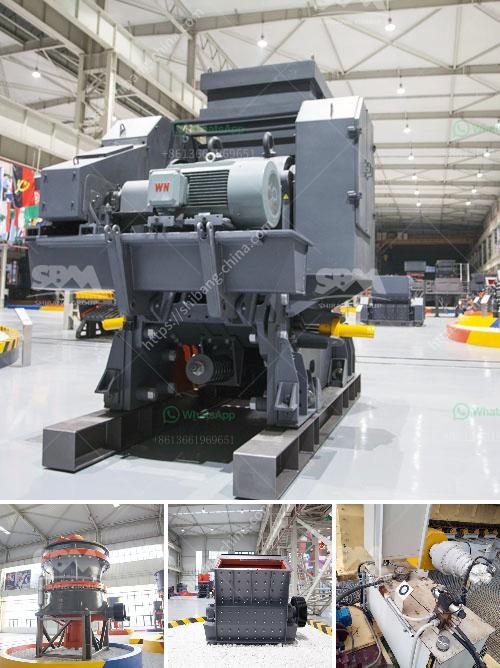

<h3>lime and dolomite plant sale</h3>
Lime and dolomite play significant roles in agriculture and horticulture by enhancing soil health and improving crop productivity. These minerals are widely used to adjust soil pH levels, provide essential nutrients, and neutralize acidic soils. As a result, the market for lime and dolomite plants has been witnessing tremendous growth. The demand for these plants is projected to rise in the upcoming years due to the increasing emphasis on sustainable agriculture and the need for efficient soil management practices.

Lime, or calcium hydroxide, is commonly applied to soils that are too acidic, as it helps in neutralizing the acidity and making the soil more suitable for growing crops. It also provides plants with essential nutrients, such as calcium, which is crucial for the development of strong cell walls and proper plant growth. Additionally, lime improves soil structure, enhances water retention abilities, and promotes the growth of beneficial soil microorganisms. All these factors contribute to better crop yields and overall soil health.

Dolomite, on the other hand, is a mineral that contains both calcium and magnesium carbonates. It is primarily used to correct magnesium deficiencies in the soil, as well as to balance soil pH levels. Dolomite plays a crucial role in preventing nutrient imbalances, as magnesium is essential for chlorophyll synthesis, while calcium aids in cell division and fruit development. By providing these essential elements, dolomite promotes healthy plant growth and improves the quality of harvested crops.

Lime and dolomite plants for sale are designed to produce these essential minerals in an efficient and cost-effective manner. These plants encompass various processes, including crushing, screening, grinding, and the addition of other ingredients, depending on the desired properties of the final product. Lime and dolomite plants are equipped with advanced technologies that ensure high-quality output and minimize environmental impact.

The increasing awareness among farmers and gardeners about the importance of soil health has fueled the demand for lime and dolomite plants. Understanding the specific needs of their soils, more and more agricultural professionals are seeking these plants to effectively manage soil acidity and deficiencies. Additionally, the rising trend of sustainable agriculture practices and organic farming has added to the surge in demand for lime and dolomite plants.

Furthermore, lime and dolomite plants offer a cost-effective solution for large-scale agricultural enterprises as well as small-scale farmers. These plants enable farmers to produce their own lime and dolomite on-site, eliminating the need for purchasing these minerals from external sources. This not only reduces costs but also ensures a consistent supply of high-quality lime and dolomite for their agricultural operations.

In conclusion, the sale of lime and dolomite plants is witnessing significant growth due to the increasing awareness about soil health and the need for sustainable agriculture practices. These plants play a vital role in improving soil acidity, providing essential nutrients, and enhancing crop productivity. The ability to produce lime and dolomite on-site offers numerous benefits, from cost savings to a consistent supply of high-quality minerals. As the agricultural sector continues to prioritize soil management and sustainable practices, the demand for lime and dolomite plants is expected to further rise in the coming years.
<h3>Contact us</h3><ul><li><strong>Whatsapp:&nbsp;<a href="https://wa.me/8613661969651">+8613661969651</a></strong></li><li><a href="https://swt.shibang-china.com/?git&amp;zhl&amp;lime and dolomite plant sale"><strong>Online Service(chat now)</strong></a></li></ul><h3>Related</h3><ul><li><a href='cone crusher in mexico.md'>cone crusher in mexico</a></li><li><a href='distributor crusher di indonesia.md'>distributor crusher di indonesia</a></li><li><a href='manufacturer of slag roller crusher in philippines.md'>manufacturer of slag roller crusher in philippines</a></li><li><a href='gypsum crusher for sale india.md'>gypsum crusher for sale india</a></li><li><a href='lime stone crusher plant.md'>lime stone crusher plant</a></li></ul>