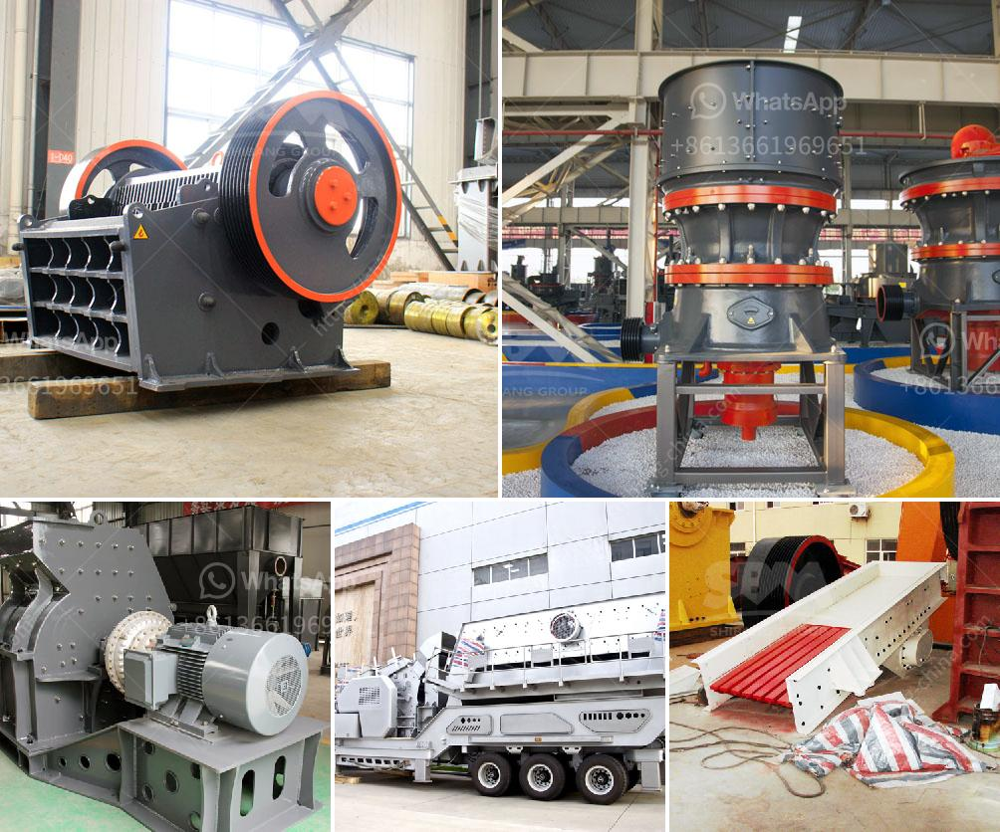

<h3>lime crushing plant components</h3>
Lime is an important chemical with various applications. It is widely used in the construction industry, agriculture, water treatment, and more. Lime is produced by crushing limestone rock in a lime crushing plant. This process involves several steps and various components, ensuring the quality and consistency of the final product. In this article, we will take a closer look at the key components of a lime crushing plant.

1. Limestone Quarry: The first and foremost component of a lime crushing plant is a limestone quarry. This is where the limestone rocks are extracted from the earth's crust. Limestone is a sedimentary rock composed mainly of calcium carbonate, which is the primary ingredient of lime. The limestone quarry must have an adequate supply to meet the demands of the crushing plant.

2. Crushing and Screening Equipment: After the limestone rocks are extracted from the quarry, they need to be crushed into smaller sizes. Crushing and screening equipment are used for this purpose. The crushing equipment includes a primary crusher that breaks down the rocks into smaller pieces. The secondary crusher further reduces the size of the crushed material. The screening equipment separates the crushed limestone into various sizes for different applications.

3. Conveyors and Feeders: Conveyors and feeders play a crucial role in transporting the limestone from one part of the crushing plant to another. These components ensure a smooth and continuous flow of material, optimizing the efficiency of the crushing process. Conveyors are used to transport the crushed limestone to different storage areas, while feeders control the flow of limestone into the crushers.

4. Storage and Handling Systems: Once the limestone is crushed, it needs to be stored in appropriate storage systems. Silos and hoppers are commonly used for this purpose. These storage systems ensure the availability of limestone for the production process. Additionally, proper handling equipment, such as loaders and forklifts, are necessary to move limestone from storage areas to the required production areas.

5. Dust Collection and Air Pollution Control Systems: Crushing limestone can generate dust and air pollution. To mitigate these environmental concerns, lime crushing plants are equipped with dust collection systems that capture and filter the dust particles. This helps maintain air quality in and around the plant, ensuring the safety of workers and the environment.

6. Control Systems: Lime crushing plants are equipped with advanced control systems that monitor and regulate the operation of various components. These control systems ensure the efficient and safe operation of the crushing plant. They also enable plant operators to optimize the production process, adjust feed rates, and maintain consistent quality of the crushed limestone.

In conclusion, lime crushing plants consist of several key components that work together to produce high-quality lime. These components include the limestone quarry, crushing and screening equipment, conveyors and feeders, storage and handling systems, dust collection and air pollution control systems, and control systems. Each component plays a vital role in the production process, ensuring the efficient and safe operation of the lime crushing plant.
<h3>Contact us</h3><ul><li><strong>Whatsapp:&nbsp;<a href="https://wa.me/8613661969651">+8613661969651</a></strong></li><li><a href="https://swt.shibang-china.com/?git&amp;zhl&amp;lime crushing plant components"><strong>Online Service(chat now)</strong></a></li></ul><h3>Related</h3><ul><li><a href='about used stone crushers in america.md'>about used stone crushers in america</a></li><li><a href='sand dryer for sale in zimbabwe.md'>sand dryer for sale in zimbabwe</a></li><li><a href='eagle 1400 crusher for sale.md'>eagle 1400 crusher for sale</a></li><li><a href='biggest cone crusher in africa.md'>biggest cone crusher in africa</a></li><li><a href='cement mill manufacturers in italy.md'>cement mill manufacturers in italy</a></li></ul>