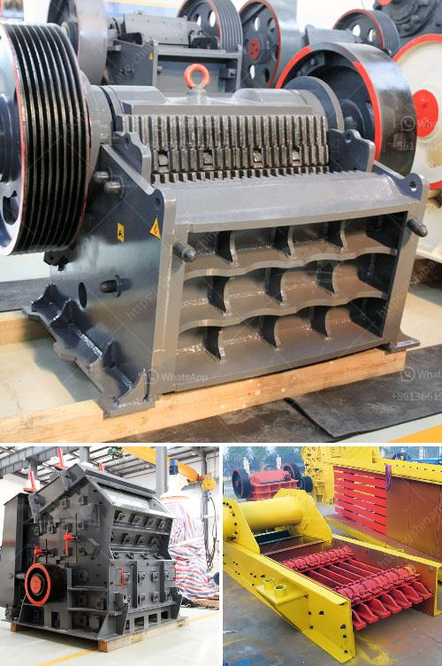

<h3>lime processing plant hammer mill</h3>
A lime processing plant is a facility where limestone is converted into usable lime products through the crushing and grinding process. The hammer mill is a common piece of equipment in this industry and is used for breaking down the limestone into smaller particles.

The hammer mill works by feeding the material into the crushing chamber, where high-speed rotating hammers impact and break it into smaller particles. The size of the final product depends on the size of the openings in the hammer mill screens, which can range from as small as 1mm to as large as 25mm.

One of the key benefits of using a hammer mill in a lime processing plant is its versatility. It can handle a wide variety of materials, including limestone, gypsum, coal, and even hard ores, making it suitable for various applications. Additionally, the hammer mill can produce a consistent and uniform particle size, ensuring that the lime products meet the desired specifications.

In a lime processing plant, the most common use of the hammer mill is to produce agricultural lime, a soil amendment that helps neutralize acidic soils. Agricultural lime is made by crushing limestone into a fine powder and is typically spread on fields using a spreader truck. The smaller particle size achieved through the hammer mill results in a more effective and faster-acting soil amendment.

Another application of the hammer mill in a lime processing plant is the production of hydrated lime, which is used in a wide range of industries, including mortar, plaster, and paint manufacturing. Hydrated lime is produced by adding water to quicklime, a process known as slaking, to produce a fine, white powder. The hammer mill can grind the quicklime into the desired particle size before the slaking process, ensuring an efficient and high-quality hydrated lime product.

Overall, the hammer mill plays a crucial role in the lime processing plant, providing an efficient and versatile solution for breaking down limestone into smaller particles. Its ability to handle various materials and produce a consistent particle size makes it an essential piece of equipment in this industry. Whether it is for producing agricultural lime or hydrated lime, the hammer mill ensures the lime products meet the desired specifications and can be used across various applications.
<h3>Contact us</h3><ul><li><strong>Whatsapp:&nbsp;<a href="https://wa.me/8613661969651">+8613661969651</a></strong></li><li><a href="https://swt.shibang-china.com/?git&amp;zhl&amp;lime processing plant hammer mill"><strong>Online Service(chat now)</strong></a></li></ul><h3>Related</h3><ul><li><a href='coal washing process machine price.md'>coal washing process machine price</a></li><li><a href='roller mill advantages.md'>roller mill advantages</a></li><li><a href='gypsum powder making germany machinery.md'>gypsum powder making germany machinery</a></li><li><a href='ball mill specification.md'>ball mill specification</a></li><li><a href='rock quarry crusher machinery.md'>rock quarry crusher machinery</a></li></ul>