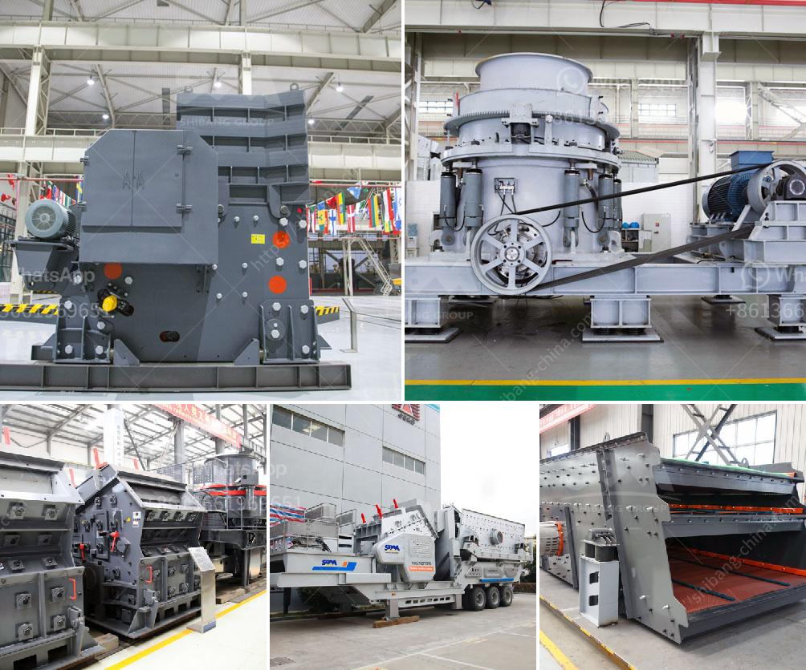

<h3>lime stone crusher plant</h3>
Limestone is a sedimentary rock composed mostly of the mineral calcite and comprising about 15% of the Earth’s sedimentary crust. It is a basic building block of the construction industry and a chief material from which aggregate, cement, lime, and building stone are made.

71% of all crushed stone produced in the U.S. is either limestone or dolomite. As a source for lime, it is used to make paper, plastics, glass, paint, steel, cement, carpets, used in water treatment and purification plants and in the processing of various foods and household items.

Limestone is also a crucial material for road construction and shows no signs of slowing down as we look to update our roads and urban infrastructure. Limestone quarrying is a labor-intensive process that requires special considerations to protect the environment, minimize blasting and vibrations, and comply with pertinent laws and regulations.

Lime stone crusher plant in 70tph capacity is one of the primary crushers, as these are built for heavy-duty operations and designed for high productivity levels. The larger feed opening also means they can potentially increase the throughput rates. The portable plant ensures easy transportation, set-up flexibility, and facilitates quick relocation to different job sites.

The demand for crushed limestone is expected to increase rapidly with the growth of the construction industry. Massive infrastructure projects, such as the construction of airports, highways, and railways, create a huge demand for crushed limestone. To meet these demands, a crusher plant is required to process the mined limestone into specific sizes for further processing.

Limestone crusher plant provides a source of construction material for infrastructure projects and helps in reducing cost and time. It can be categorized into stationary crushing plant and mobile crushing plant. Depending on the design and application, stationary crusher plant and mobile crusher equipment can be customized in different sizes, shapes, and configurations. Portable crushing plants are also popular in the mining industry where different sizes of limestone are needed for various applications.

In conclusion, limestone crusher plant is essential for construction material break up and screening facilities in the manufacturing of aggregates, which are essential to several industries. As a result, limestone crusher equipment is becoming more and more important in today's construction field.
<h3>Contact us</h3><ul><li><strong>Whatsapp:&nbsp;<a href="https://wa.me/8613661969651">+8613661969651</a></strong></li><li><a href="https://swt.shibang-china.com/?git&amp;zhl&amp;lime stone crusher plant"><strong>Online Service(chat now)</strong></a></li></ul><h3>Related</h3><ul><li><a href='mineral processing equipment.md'>mineral processing equipment</a></li><li><a href='deed of stone mining business.md'>deed of stone mining business</a></li><li><a href='want to increase productivity for stone crushers.md'>want to increase productivity for stone crushers</a></li><li><a href='lister petter maize hammer mills.md'>lister petter maize hammer mills</a></li><li><a href='raymond mill plant.md'>raymond mill plant</a></li></ul>