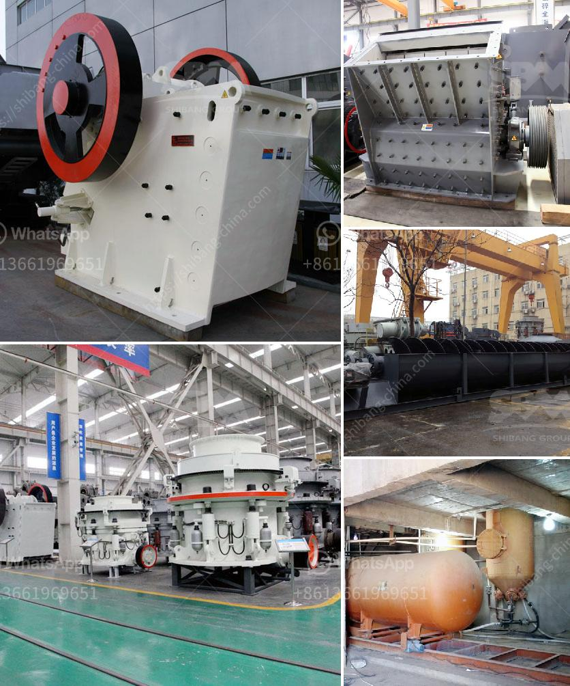

<h3>lime stone crusher spesifikasi</h3>
Limestone is a sedimentary rock that is mainly composed of calcium carbonate (CaCO3) in the form of calcite or aragonite. It is abundant, widely available, and used as a building material worldwide. To extract the valuable calcium carbonate, limestone needs to be crushed and processed into a fine powder. One essential piece of equipment used in this process is a limestone crusher.

A limestone crusher is a machine that is designed to crush large chunks of limestone into smaller pieces. The primary jaw crusher is typically used to crush large limestone and occasionally other rocks. When it comes to selecting the perfect crusher spesifikasi, there are a few important factors to consider.

First, the crusher must be capable of handling a wide variety of materials, including limestone with a high moisture content. This is because limestone tends to be sticky and can cause blockages in the crusher. A crusher with a large opening and a robust design is ideal for processing limestone efficiently.

Second, the crusher should have a high production capacity. A high-capacity crusher can handle large volumes of limestone in a shorter time, making the operation more efficient. Additionally, a crusher with a high capacity can accommodate larger-sized materials, which may be beneficial if there are larger limestone chunks in the quarry.

Third, the crusher should be easy to maintain and service. A limestone crusher is subjected to constant wear and tear due to the nature of the material being crushed. Therefore, regular maintenance and servicing are crucial to prolonging the lifespan of the crusher. A crusher that is easy to access and has spare parts readily available will minimize downtime and increase productivity.

Lastly, the crusher should have safety features in place to protect the operator and the machine. This may include safety guards, emergency stops, and clearly marked danger zones.

In conclusion, a limestone crusher spesifikasi should be selected based on its ability to handle a wide variety of materials, its production capacity, ease of maintenance and service, and safety features. By considering these factors, a suitable crusher can be chosen to optimize the crushing process and produce high-quality crushed limestone for various applications.
<h3>Contact us</h3><ul><li><strong>Whatsapp:&nbsp;<a href="https://wa.me/8613661969651">+8613661969651</a></strong></li><li><a href="https://swt.shibang-china.com/?git&amp;zhl&amp;lime stone crusher spesifikasi"><strong>Online Service(chat now)</strong></a></li></ul><h3>Related</h3><ul><li><a href='used conveyor belt in kenya.md'>used conveyor belt in kenya</a></li><li><a href='concrete crushing plant in dubai.md'>concrete crushing plant in dubai</a></li><li><a href='crushing plants for sale in sri lanka.md'>crushing plants for sale in sri lanka</a></li><li><a href='quarry crusher machinery for sale.md'>quarry crusher machinery for sale</a></li><li><a href='hammer mill for oregano.md'>hammer mill for oregano</a></li></ul>