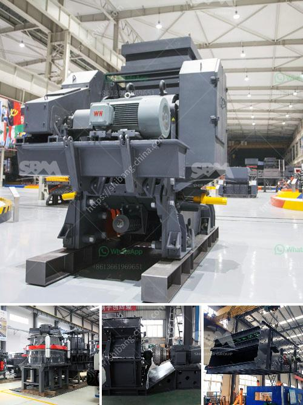

<h3>lime stone crusher</h3>
Limestone is a sedimentary rock that is mainly composed of calcium carbonate (CaCO3) in the form of calcite mineral. It also contains small amounts of other minerals such as clay, silica, pyrite, and iron oxides. The raw material for lime production is limestone or, to a lesser extent, dolomite or dolomitic limestone.

Limestone is a popular material used in various industries such as cement, agriculture, and construction. In order to obtain the desired end product, it is essential to efficiently crush limestone into smaller, manageable particles. This is where a limestone crusher comes into play.

Limestone crushers are designed to break stone into smaller sizes. These machines are capable of crushing hard and abrasive materials such as limestone, sandstone, gravel, and granite into different sizes. Smaller particles (graded from 2mm to 10mm) are particularly suitable for the production of lime.

Limestone crushing equipment has a very bright prospect. With the development of steel and cement industry, the demand for limestone will be further increased. Cement industry is developing rapidly, and cement production is huge. More than one hundred million tons of limestone are used for cement products each year. Therefore, the development prospects of limestone industry are very bright.

The limestone crusher produced by our factory has strong crushing capacity, low energy consumption and environmental protection performance. It can crush high-strength limestone, granite, basalt, river pebble, marble, etc. until the materials meet the requirements of the cement production process. The machine can be used in the construction, metallurgical, chemical, and other industries and is widely used to crush large limestone into small pieces for further processing.

The limestone crusher machine is a highly efficient crushing machine, the maintenance downtime is reduced, and the production efficiency is improved. It is suitable for crushing medium-hard materials, such as limestone, slag, coke, coal and other materials in the cement industry, chemical industry, electric power industry, and other industrial sectors.

Due to its wide application and high degree of refinement, the limestone crusher is widely used in various fields such as cement, metallurgy, chemical industry, electric power, building materials, and highways. It has a significant role in improving project efficiency, reducing costs, and ensuring product quality.

In conclusion, limestone crushing machines like jaw crusher, impact crusher, hammer crusher, and cone crusher play a very important role in the limestone crushing process. Their advantages are a high degree of automation, reliable performance, stable operation, simple structure, and convenient maintenance. So, how to select a suitable limestone crusher? The key factors to be considered are the production capacity, hardness, particle size, and the requirements of the finished products. In addition, as the environmental protection requirements are getting stricter, it is also necessary to select a limestone crusher with good dust removal system to reduce pollution.
<h3>Contact us</h3><ul><li><strong>Whatsapp:&nbsp;<a href="https://wa.me/8613661969651">+8613661969651</a></strong></li><li><a href="https://swt.shibang-china.com/?git&amp;zhl&amp;lime stone crusher"><strong>Online Service(chat now)</strong></a></li></ul><h3>Related</h3><ul><li><a href='stone crusher primary jaw to buy in nigeria.md'>stone crusher primary jaw to buy in nigeria</a></li><li><a href='crusher for crushing ore in gold mining plant.md'>crusher for crushing ore in gold mining plant</a></li><li><a href='cone crusher manufacturers china.md'>cone crusher manufacturers china</a></li><li><a href='graphite mining equipment in madagascar suppliers.md'>graphite mining equipment in madagascar suppliers</a></li><li><a href='granite crusher price list.md'>granite crusher price list</a></li></ul>