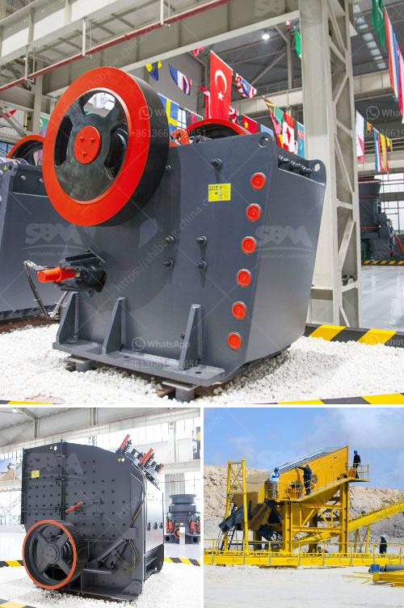

<h3>limestone crusher machine in turkey</h3>
Limestone is a sedimentary rock composed of calcium carbonate (CaCO3) and is typically used as building material or for the production of cement. It is a crucial component in many industries, especially in agriculture and manufacturing processes. Limestone crusher machines are used in crushing limestone rocks for various purposes, such as making cement, mortar, and even asphalt.

Turkey is well-known for its extensive limestone reserves and is among the top exporters of this rock worldwide. Many limestone crushing plants in Turkey adopt advanced limestone crushing technology because of its high efficiency and low operational cost. The factors that affect the crushing process can be classified into three phases, namely, choosing the appropriate crushing machine, setting the feeding size, and the crushing ratio, and selecting the property of the limestone.

When it comes to selecting the right limestone crusher machine, manufacturers should consider several factors such as the materials' hardness, abrasiveness, and capacity requirements. These factors help manufacturers determine the suitable crusher type. For instance, jaw crushers are mainly used for coarse crushing, and cone crushers are employed for secondary and tertiary crushing. Impact crushers and vertical shaft impact crushers are generally used for shaping the aggregates.

The feeding size and the crushing ratio are significant factors that need to be taken into account during the limestone crushing process. The primary crusher should have enough capacity to handle the largest rocks fed into the machine. It is crucial to determine the maximum size of the material that the crusher can handle, as this helps prevent unnecessary downtime and maintenance. The crushing ratio, on the other hand, refers to the proportion of the raw material that can be crushed to a specific size. Choosing the correct crushing ratio ensures the final product meets the desired specifications.

Lastly, the property of the limestone itself should be considered. Different limestone rocks have different hardness and abrasiveness. Manufacturers should choose a limestone crusher machine with a high crushing strength and reduce the maintenance cost by choosing a crusher with high speed and high efficiency. You should consider the output size requirement, such as 0-5mm, 5-10mm, and 10-15mm. Usually, the whole limestone crushing line includes primary, secondary, and tertiary crushing equipment and the vibrating feeder, belt conveyor, and vibrating screen ensure the crushing process goes smoothly and efficiently.

In conclusion, Turkey's limestone crusher machines are appropriate for diverse production requirements. They can process limestone rocks efficiently and economically and are very popular among limestone producers. With advancements in technology, Turkey's limestone crusher machines have been widely used in more fields and greatly contributed to the development of the country's construction industry and economy.
<h3>Contact us</h3><ul><li><strong>Whatsapp:&nbsp;<a href="https://wa.me/8613661969651">+8613661969651</a></strong></li><li><a href="https://swt.shibang-china.com/?git&amp;zhl&amp;limestone crusher machine in turkey"><strong>Online Service(chat now)</strong></a></li></ul><h3>Related</h3><ul><li><a href='howhow to set up a stone crushing business.md'>howhow to set up a stone crushing business</a></li><li><a href='cement plant equipment list for cost estimation.md'>cement plant equipment list for cost estimation</a></li><li><a href='diy stone crushing machine.md'>diy stone crushing machine</a></li><li><a href='pe 400 by 600 single toggle jaw crusher specifications.md'>pe 400 by 600 single toggle jaw crusher specifications</a></li><li><a href='zimbabwe clay brick making machine.md'>zimbabwe clay brick making machine</a></li></ul>