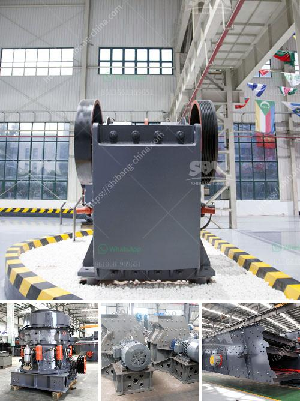

<h3>limestone crusher philippines</h3>
Limestone is a sedimentary rock that is mainly composed of calcium carbonate (CaCO3), in the form of calcite or aragonite. It is a popular building material because of its durability, low maintenance, and aesthetic appeal. With the growth of the construction industry in the Philippines, the demand for limestone crusher machines has also increased.

Limestone is an important raw material in many industries. Some of its applications include being used as a building material, making cement, steel, lime, and hydrated lime. It is also used for road base, concrete aggregate, and agricultural lime.

To meet the requirements of the industry, the Philippines is fortunate to have natural resources, including limestone, which are abundant and accessible. However, before limestone can be used in various industries, it needs to be crushed and processed into smaller pieces.

The limestone crushing process is accomplished using different crushers that can be divided into coarse crushing, medium crushing, and fine crushing. These crushers are available in stationary, portable, and mobile applications, and can crush various limestone materials, including calcite, chalk, limestone, dolomite, shell, and slates.

One of the most innovative crushers is the portable limestone crusher. It can significantly reduce the investment cost, improve the investment return rate, and shorten the investment payback time. The mobile limestone crusher is not limited by the crushing site, and reduces high transportation cost. It can crush materials on site or working nearly. It is widely used in the industry of mining, metallurgy, building materials, traffic, water conservancy, and so on.

In the Philippines, several limestone crusher machines are at work to accelerate the mining process of limestone. The jaw crusher is indispensably the first crusher machine in the limestone crushing process. The primary crushing material will be transferred to the impact crusher for further crushing. After crushing, the limestone particles will be sent to the vibrating screen for sorting, and then transported to the finished product area by the belt conveyor.

The cone crusher is another powerful and popular crushing machine that provides excellent reduction and final product cubicity. This crusher can be used as a secondary or tertiary crushing machine to crush different limestone materials.

The impact crusher is mainly used for the intermediate crushing process. It can process materials with a side length of less than 500mm, and compressive strength of up to 350Mpa. With its superior advantages and remarkable performance, it is widely used in the limestone quarrying plant in the Philippines.

The Philippines is also home to a number of limestone mining operations. The mining of limestone can greatly affect the surrounding environment. However, with the relatively advanced technology and strict environmental regulations, limestone mining impact can be minimized and controlled.

In conclusion, to meet the growing demand for limestone crusher machines, the Philippines is fortunate to have an abundant supply of limestone resources. However, appropriate crushing, processing, and environmental regulations need to be implemented to ensure sustainable mining operations. With the right equipment and best practices, the mining industry can continue to thrive while preserving the environment.
<h3>Contact us</h3><ul><li><strong>Whatsapp:&nbsp;<a href="https://wa.me/8613661969651">+8613661969651</a></strong></li><li><a href="https://swt.shibang-china.com/?git&amp;zhl&amp;limestone crusher philippines"><strong>Online Service(chat now)</strong></a></li></ul><h3>Related</h3><ul><li><a href='coal crushing plant in pakistan.md'>coal crushing plant in pakistan</a></li><li><a href='equipment for dimension stone production.md'>equipment for dimension stone production</a></li><li><a href='hammer mill capacity.md'>hammer mill capacity</a></li><li><a href='brick crushing equipment.md'>brick crushing equipment</a></li><li><a href='ton per hour gold wash plant.md'>ton per hour gold wash plant</a></li></ul>