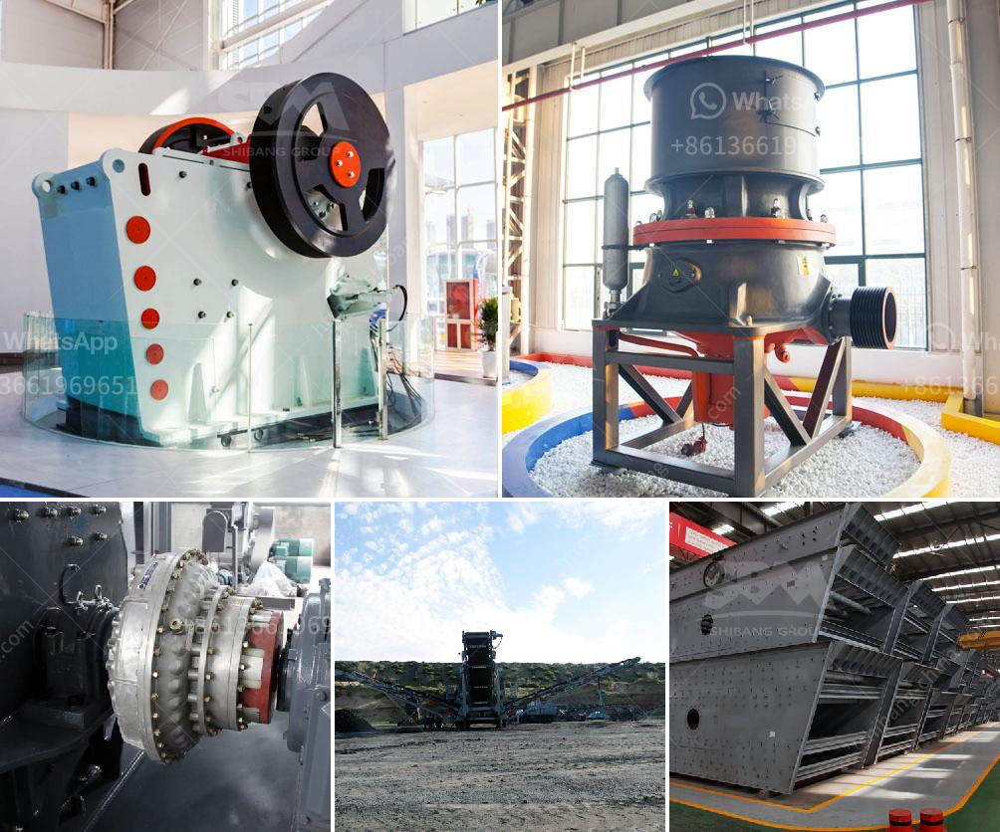

<h3>limestone crusher plant made in pakistan price</h3>
Limestone is a common rock found in the earth's crust. It is mainly composed of calcium carbonate, a mineral that is widely used in construction, agriculture, and other industries. It comes in various forms, such as chalk, limestone rock, and limestone powder. Limestone crusher plant is a machine used to crush limestone into pieces, making it suitable for construction and other industries.

In recent years, the popularity of limestone crusher plants has been widely acknowledged, particularly in Pakistan. With abundant limestone resources, Pakistan has become an important market for limestone crushers. The limestone crusher plant made by Hongxing Machinery is a complete crushing and screening plant, which endows it with great flexibility for various crushing requirements.

The complete limestone crusher plant has a great crushing ratio and high production capacity. It can produce 40-100 mesh sand, 50-100 mesh fine powder, and 325-2500 mesh micro powder. Limestone crushing plant is mainly responsible for processing the coarse materials into fine particles, and then sieving out different grain sizes as required by customers.

According to the different crushing principles and product particle sizes, limestone crusher plant can be divided into jaw crusher, impact crusher, cone crusher, sand making machine, etc. The raw material is evenly conveyed by the vibrating feeder to the jaw crusher for coarse crushing. After the initial crushing, the closed-loop system is formed through the circular vibrating screen to realize the cyclic crushing and grading of the material.

The impact crusher is mainly used for fine crushing operations in the second stage. It is mainly used in the production of limestone aggregate used in highway pavement and aggregate for wear-resistant materials. The hydraulic cone crusher can finely crush various ores and rocks with high hardness, especially for crushing the materials with medium and high hardness.

The limestone crusher plant is a kind of equipment for crushing the hardness of limestone. Limestone crusher can directly crush the material with a grain size of 600-1800 mm to a section of crusher with a grain size of 25 or less.

limestone crusher plant price in Pakistan is usually used and drastically durable, and performance-oriented. The Limestone crusher plant price in Pakistan vary depending on the type of the machine available in the market. So, if you need the price and specification of the limestone crusher plant, please feel free to contact us. Whether you're a quarry, mine, or construction business owner, or you're just developing a project of your own, we're here to help you every step of the way with your limestone crusher plant needs.

In conclusion, limestone crusher plant made in Pakistan price is reasonable and has been popularized in the past 20 years. Hongxing Machinery has strict quality control, fast after-sales service, and professional and complete factory supply. It is a wise choice for limestone processing and crushing.
<h3>Contact us</h3><ul><li><strong>Whatsapp:&nbsp;<a href="https://wa.me/8613661969651">+8613661969651</a></strong></li><li><a href="https://swt.shibang-china.com/?git&amp;zhl&amp;limestone crusher plant made in pakistan price"><strong>Online Service(chat now)</strong></a></li></ul><h3>Related</h3><ul><li><a href='sand washing machine lsx920.md'>sand washing machine lsx920</a></li><li><a href='stone conveyor belt design manual pdf.md'>stone conveyor belt design manual pdf</a></li><li><a href='antimony processing plant design.md'>antimony processing plant design</a></li><li><a href='copper recycling process.md'>copper recycling process</a></li><li><a href='vertical mill ball compsition.md'>vertical mill ball compsition</a></li></ul>