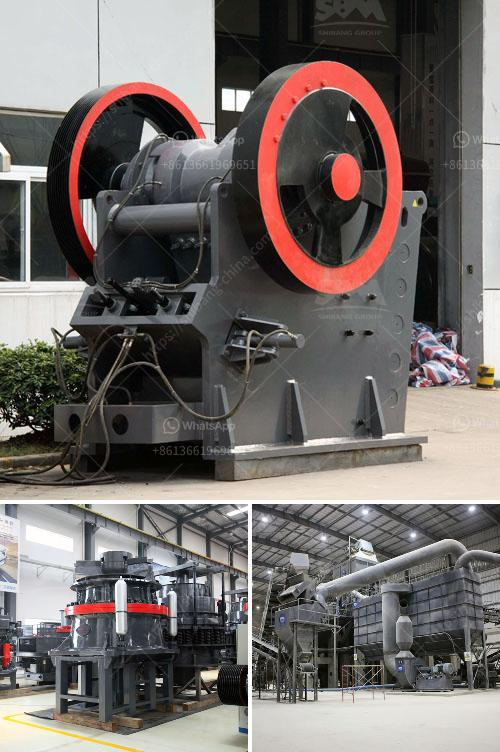

<h3>limestone crushing mill</h3>
Limestone is a sedimentary rock composed mainly of calcium carbonate (CaCO3). It is an important industrial mineral and building material, widely used in various industries due to its versatility and low cost. One of the key applications of limestone is as a raw material for cement production. To meet the growing demand for cement, limestone needs to be crushed into a fine powder before it can be used in the manufacturing process. This is where a limestone crushing mill comes into play.

A limestone crushing mill is a specialized machine used to grind limestone into a powdered form. It is used in various industrial applications such as paints, power generation, plastics, construction, and so on. In the cement industry, limestone is mixed with other materials such as shale or fly ash to form the clinker, which is then ground to produce cement.

The limestone crushing mill typically consists of a crusher, a grinder, and a classifier. The crusher breaks the big-sized limestone into smaller pieces suitable for grinding. The grinder grinds the limestone to a fine powder, which is then classified by the classifier. The finely ground limestone powder is then used as a raw material in cement production or other applications.

The limestone crushing mill is designed with advanced technology and high-quality materials. It has the advantages of reliable performance, high production efficiency, convenient operation, and easy maintenance. The machine can grind various materials with different hardness levels, ensuring the uniformity and fineness of the finished product.

Furthermore, the limestone crushing mill can be customized to meet specific requirements. The size and capacity of the mill can be adjusted to suit the production needs of different industries. Additionally, the mill can be equipped with advanced control systems to optimize its performance and reduce energy consumption.

In conclusion, a limestone crushing mill is an essential machine for limestone grinding. It enables efficient and cost-effective processing of limestone into a fine powder, suitable for various industrial applications. With its advanced technology and customizable features, the limestone crushing mill offers a reliable and high-performance solution for limestone grinding.
<h3>Contact us</h3><ul><li><strong>Whatsapp:&nbsp;<a href="https://wa.me/8613661969651">+8613661969651</a></strong></li><li><a href="https://swt.shibang-china.com/?git&amp;zhl&amp;limestone crushing mill"><strong>Online Service(chat now)</strong></a></li></ul><h3>Related</h3><ul><li><a href='basalt crushing machine.md'>basalt crushing machine</a></li><li><a href='process flow gold copper mining.md'>process flow gold copper mining</a></li><li><a href='ball mill manufacturers gypsum.md'>ball mill manufacturers gypsum</a></li><li><a href='crusher mill for china price.md'>crusher mill for china price</a></li><li><a href='packing plant in cement industry.md'>packing plant in cement industry</a></li></ul>