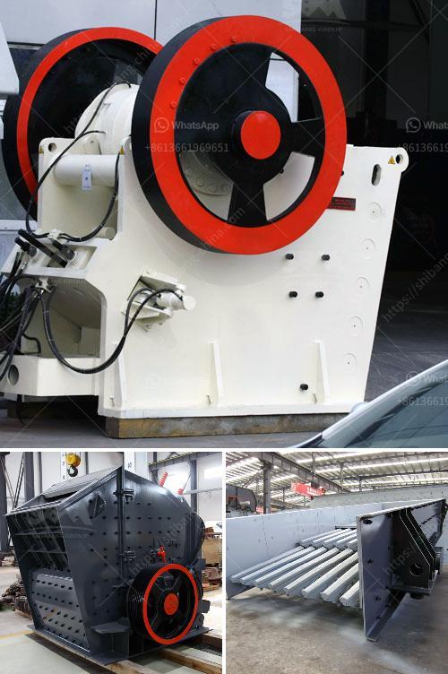

<h3>limestone feeding equipment cost</h3>
Limestone is a crucial mineral resource that has various applications in industries such as construction, agriculture, and manufacturing. It is used as a raw material in the production of cement, steel, glass, and many other products. To properly utilize limestone, it needs to be crushed into smaller sizes and fed into processing equipment. In this article, we will discuss the cost of limestone feeding equipment and its significance in the overall production process.

Limestone feeding equipment primarily consists of vibrating feeders and conveyors. These equipment help in the efficient and continuous transportation of limestone from one process to another. The cost of such equipment can vary depending on several factors, including the required capacity, the type of equipment, and its specifications.

One of the primary factors affecting the cost of limestone feeding equipment is the required capacity. Different industries have different production demands, and therefore, the capacity of the feeding equipment needs to be determined accordingly. Vibrating feeders and conveyors are available in various sizes and capacities, each with a different price range. Higher capacity equipment usually comes at a higher cost due to the larger motors, stronger construction materials, and more advanced control systems required.

The type of limestone feeding equipment also plays a significant role in determining its cost. Vibrating feeders and conveyors can be either electromechanical or electromagnetic. Electromechanical feeders are more common and have a lower initial cost compared to electromagnetic feeders. However, electromagnetic feeders offer better control and precision in feeding, which makes them ideal for applications where precise dosing is required. As a result, electromagnetic feeders tend to be more expensive.

Apart from the type and capacity, the specifications of the limestone feeding equipment can also impact its cost. Factors such as the material of construction, drive systems, and additional features can influence the price. For instance, if the equipment needs to handle abrasive limestone, special wear-resistant liners may be required, which can increase the overall cost. Similarly, if the equipment needs to operate in a corrosive environment, corrosion-resistant materials may be necessary.

While the cost of limestone feeding equipment is an important consideration, it is equally essential to understand its significance in the production process. Efficient feeding of limestone ensures smooth operation of downstream processes, reducing downtime, and enhancing productivity. Additionally, well-designed feeding equipment minimizes material spillage, dust emissions, and fugitive losses, leading to cost savings and environmental benefits.

Investing in high-quality limestone feeding equipment may initially seem like a significant expense. However, it is a crucial investment that can result in long-term cost savings and improved production efficiency. Reliable and robust equipment reduces maintenance and repair costs, ensuring uninterrupted operation and longevity.

In conclusion, the cost of limestone feeding equipment depends on factors such as capacity, type, and specifications. Investing in the right feeding equipment is essential for smooth and efficient limestone processing operations. While the initial cost may be a consideration, the long-term benefits in terms of increased productivity, reduced downtime, and improved product quality outweigh the investment. Therefore, it is crucial for industries utilizing limestone to carefully evaluate their feeding equipment requirements and seek professional guidance to select the most suitable equipment for their specific needs.
<h3>Contact us</h3><ul><li><strong>Whatsapp:&nbsp;<a href="https://wa.me/8613661969651">+8613661969651</a></strong></li><li><a href="https://swt.shibang-china.com/?git&amp;zhl&amp;limestone feeding equipment cost"><strong>Online Service(chat now)</strong></a></li></ul><h3>Related</h3><ul><li><a href='rotary screen for coal making process.md'>rotary screen for coal making process</a></li><li><a href='produsen mesin ultra fine grinding.md'>produsen mesin ultra fine grinding</a></li><li><a href='principle of impact crusher.md'>principle of impact crusher</a></li><li><a href='cement grinding machinery europe.md'>cement grinding machinery europe</a></li><li><a href='china cone crushers.md'>china cone crushers</a></li></ul>