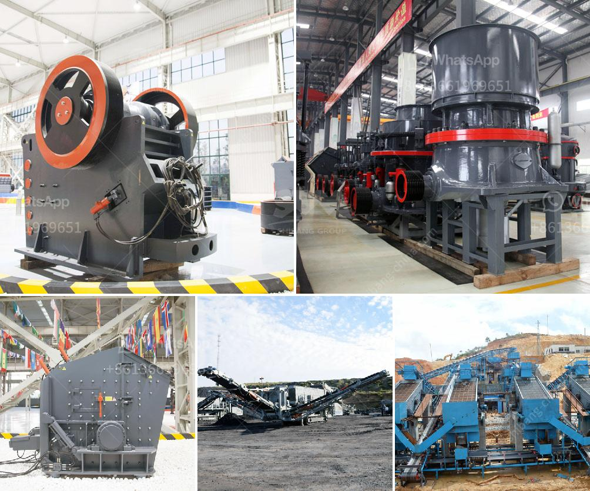

<h3>limestone fine grind plant for sale</h3>
Limestone is a widely used natural stone that adds elegance and durability to any space. Whether it's for indoor or outdoor applications, limestone is favored for its aesthetic appeal and ability to withstand various weather conditions. If you're in the market for limestone and are looking for a reliable source, then a limestone fine grind plant for sale may be the perfect solution for you.

A limestone fine grind plant is a facility that crushes, grinds, and screens limestone to a fine powder. This powder can be used in a variety of applications, such as creating stone veneer, manufacturing concrete, or producing lime. The fine grind plant allows for the production of high-quality limestone powder that is consistently sized and ready for use.

One of the major advantages of using limestone in construction or landscaping projects is its durability. Limestone is a dense and hard stone that can withstand heavy traffic, extreme temperatures, and the ravages of time. It ages beautifully, developing a natural patina that adds character and charm to any space. Additionally, limestone is highly resistant to moisture, making it an excellent choice for outdoor applications, such as walkways, patios, and pool decks.

The limestone fine grind plant offers a wide range of options to suit various needs and preferences. You can choose from a variety of limestone colors, textures, and finishes to match your specific design requirements. From classic neutrals like beige and gray to vibrant shades of brown and gold, there's a limestone option for every style and taste. The fine grind plant ensures that the limestone is finely ground, resulting in a smooth and uniform surface that is visually appealing and pleasant to touch.

Furthermore, purchasing limestone from a fine grind plant guarantees that you're getting a high-quality product. The limestone is carefully processed and tested to meet strict quality standards. Whether you're a homeowner or a contractor, you can trust that the limestone you receive is consistent in quality and will enhance the beauty and durability of your space.

In conclusion, a limestone fine grind plant for sale offers a convenient and reliable solution for sourcing high-quality limestone powder. With its durability, versatility, and aesthetic appeal, limestone is a popular choice for a wide range of applications. Whether you're looking to enhance the interior of your home or create an inviting outdoor space, limestone can fulfill your design needs. By purchasing from a reputable fine grind plant, you can be confident in the quality and consistency of the limestone you receive, ensuring a successful and enduring project.
<h3>Contact us</h3><ul><li><strong>Whatsapp:&nbsp;<a href="https://wa.me/8613661969651">+8613661969651</a></strong></li><li><a href="https://swt.shibang-china.com/?git&amp;zhl&amp;limestone fine grind plant for sale"><strong>Online Service(chat now)</strong></a></li></ul><h3>Related</h3><ul><li><a href='stone crusher equipments.md'>stone crusher equipments</a></li><li><a href='lafarge evander quartz crushers.md'>lafarge evander quartz crushers</a></li><li><a href='business plan on manganese ore mining crusher.md'>business plan on manganese ore mining crusher</a></li><li><a href='barite mining equipment.md'>barite mining equipment</a></li><li><a href='grinding mills jalandhar.md'>grinding mills jalandhar</a></li></ul>