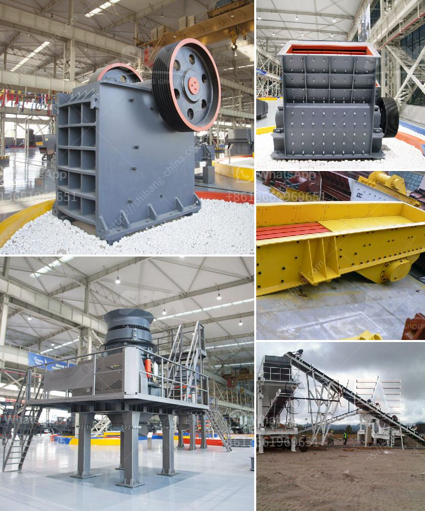

<h3>limestone grinding roller mill</h3>
Limestone is a natural rock composed mainly of calcium carbonate (CaCO3). It can be processed into different forms and used for various purposes, such as building materials, industrial raw materials, and agriculture. One of the most effective methods to process limestone is through the use of a grinding roller mill. This article will discuss the advantages and applications of the limestone grinding roller mill.

The limestone grinding roller mill is a device specially developed and produced for the characteristics of limestone. It is a kind of equipment for medium and fine crushing, grinding, and grading of limestone. It can process limestone into fine powder with a particle size distribution of 325-3000 mesh. The equipment has a large crushing ratio, high energy utilization rate, large production capacity, and low energy consumption.

One of the advantages of the limestone grinding roller mill is its wide range of applications. The equipment can be used for grinding various ores: limestone, calcite, dolomite, barite, gypsum, talc, diabase, quartz, bentonite, etc. It can also be used for grinding non-metallic minerals such as ceramics and refractory materials. In addition, the grinding roller mill can also be used in the cement industry for grinding raw materials and clinker, as well as in the metallurgical industry for grinding various ores and other materials.

Compared with traditional grinding equipment, the limestone grinding roller mill has the following advantages:

1. High efficiency: The equipment adopts a multi-layer grinding ring and multiple grinding rollers to achieve efficient grinding. The grinding efficiency is increased by more than 40% compared with traditional Raymond mills.

2. High precision: The grinding roller mill adopts a full pulse dust removal system, which effectively controls the dust pollution and achieves a clean and environmentally friendly production workshop.

3. High reliability: The main transmission device of the grinding roller mill adopts a sealed gear box and pulley, which has stable transmission, low noise, and long service life.

4. Low energy consumption: The grinding roller mill uses advanced energy-saving technology and advanced grinding principle, which greatly reduces energy consumption and operating costs. Compared with the same type of equipment, it can save more than 40% of energy consumption.

With the continuous development of the milling industry, the limestone grinding roller mill has been widely used in various industries. It not only improves production efficiency but also reduces energy consumption and environmental pollution. The limestone grinding roller mill is a high-quality and efficient grinding equipment for limestone processing. It can effectively improve the utilization rate of limestone resources and provide an efficient and environmentally friendly grinding solution for various industries.
<h3>Contact us</h3><ul><li><strong>Whatsapp:&nbsp;<a href="https://wa.me/8613661969651">+8613661969651</a></strong></li><li><a href="https://swt.shibang-china.com/?git&amp;zhl&amp;limestone grinding roller mill"><strong>Online Service(chat now)</strong></a></li></ul><h3>Related</h3><ul><li><a href='gravel wash plant for sale.md'>gravel wash plant for sale</a></li><li><a href='gypsum powder production plants.md'>gypsum powder production plants</a></li><li><a href='mining and quarry machines manifactures.md'>mining and quarry machines manifactures</a></li><li><a href='mobile iron ore impact crusher suppliers in india.md'>mobile iron ore impact crusher suppliers in india</a></li><li><a href='cone crusher made in italy.md'>cone crusher made in italy</a></li></ul>