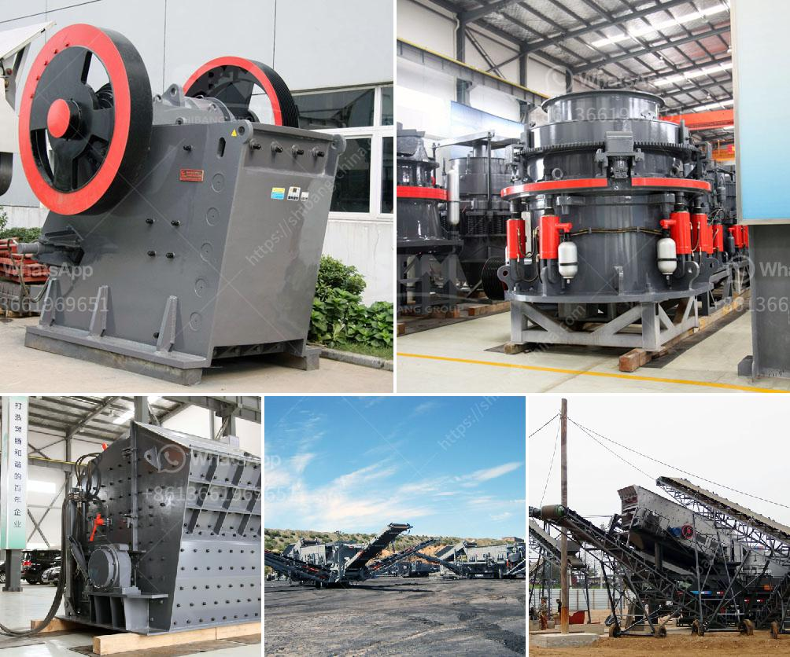

<h3>limestone impact crushers</h3>
Limestone is a common rock with a wide range of uses. It is widely used as building materials, industrial raw materials, and agricultural lime. With the application of impact crushers in limestone crushing process, more and more limestone crushers are needed in cement plants and other industries. Impact crushers play a key role in limestone crushing plants and significantly improve the production capacity and grain shape of finished materials.

The impact crusher is designed to crush limestone into small particles, which helps to increase the working efficiency and reduce the high cost of raw materials. It is widely used in the industries of hydroelectric, building materials, highway, and urban construction. By optimizing the cavity type and combining the principle of laminated crushing, impact crushers are excellent in cubic shape and less needle-like particles, making them suitable for high-standard construction aggregates.

One of the main advantages of the impact crusher is its flexibility and versatility. It can process materials with a side length of 100-500 mm and a compressive strength of up to 350 MPa. It has a large crushing ratio and a cubic particle shape after crushing, which is suitable for crushing medium-hard and brittle materials, such as limestone. The impact crusher has a simple structure, low cost, stable operation, high efficiency and energy saving, and good grain shape.

Compared with other crushers, impact crushers have larger crushing ratios and can make full use of the high-speed impact energy of the entire rotor. In the process of limestone crushing, impact crushers are usually configured as a secondary or tertiary crushing unit to reduce the particle size of materials for further processing.

In the actual production, the impact crusher is also the main crusher machine used in limestone production line. The crushing ratio of impact crusher is about 30-40, even the max can be 150. While the max ratio of cone crusher and jaw crusher can only reach the range of 20. Therefore, the impact crusher is more suitable for crushing limestone with low hardness (Mohs hardness < 4). The wearing parts of impact crushers are less worn than those of hammer crushers and have higher metal utilization rate. Therefore, the investment cost and production cost of impact crushers are lower than that of hammer crushers.

In conclusion, the impact crusher is comparatively better suited for crushing limestone with low hardness and producing high-quality finished products. With the advantages of large crushing ratio, high crushing efficiency, low power consumption, and excellent grain shape, impact crushers are widely used in limestone crushing plants and other industries. They are considered as indispensable equipment in limestone processing and contribute to the rapid development of various industries.
<h3>Contact us</h3><ul><li><strong>Whatsapp:&nbsp;<a href="https://wa.me/8613661969651">+8613661969651</a></strong></li><li><a href="https://swt.shibang-china.com/?git&amp;zhl&amp;limestone impact crushers"><strong>Online Service(chat now)</strong></a></li></ul><h3>Related</h3><ul><li><a href='gravel crushing plant.md'>gravel crushing plant</a></li><li><a href='about used stone crushers in america.md'>about used stone crushers in america</a></li><li><a href='marble production line germany.md'>marble production line germany</a></li><li><a href='russia equipment manufacturers mining.md'>russia equipment manufacturers mining</a></li><li><a href='crushing and screening equipment prices south africa.md'>crushing and screening equipment prices south africa</a></li></ul>