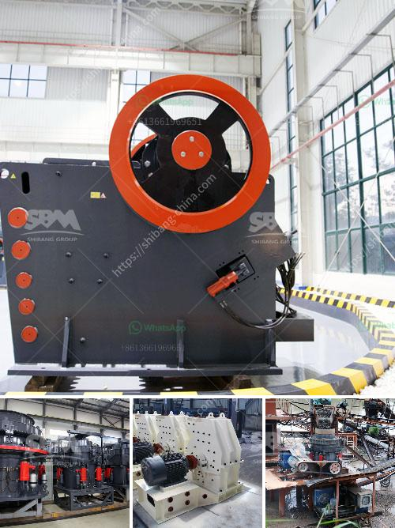

<h3>limestone micronizer machine limestone micronizer mill</h3>
Limestone is a sedimentary rock that is composed of calcium carbonate minerals, mainly calcite and aragonite. It is widely used in various industries such as construction, agriculture, and chemical manufacturing. However, before limestone can be effectively utilized, it needs to be finely ground into a powder form.

Traditionally, the grinding and processing of limestone have been performed manually, resulting in inconsistency in particle size and overall inefficiency in the production process. However, with the advent of limestone micronizer machines, the industry has witnessed a revolution in limestone processing.

A limestone micronizer machine, also known as a limestone micronizer mill, utilizes mechanical grinding to produce ultra-fine particles of limestone powder. This process not only improves the quality of the final product but also increases the overall production efficiency.

One of the key advantages of using a limestone micronizer machine is its ability to achieve a precise particle size distribution. This means that the desired size and shape of limestone particles can be easily obtained, resulting in a superior end product. Whether it is for use in building materials, agriculture, or industrial applications, a consistent particle size is crucial for optimal performance.

Furthermore, a limestone micronizer machine offers a high level of scalability. It can handle large quantities of limestone and produce a significant amount of powdered limestone in a relatively short period. This makes it ideal for large-scale industrial operations where the demand for limestone is high.

Moreover, limestone micronizer machines are designed for energy efficiency. They employ advanced technologies and materials that minimize energy consumption without compromising on productivity. This not only makes them environmentally friendly but also helps reduce operating costs for businesses.

In addition to its efficiency and scalability, a limestone micronizer machine also boasts low maintenance requirements. Its robust construction ensures durability, allowing the machine to withstand continuous operation without frequent breakdowns. This translates into reduced downtime and increased productivity.

Furthermore, the automated operation of a limestone micronizer machine simplifies the overall limestone processing process. It eliminates the need for manual labor, reducing the risk of human error and ensuring consistent quality control. Operators can easily adjust the parameters of the machine to obtain the desired particle size, ensuring optimal performance.

Overall, the introduction of limestone micronizer machines has revolutionized the limestone processing industry. The combination of precise particle size distribution, scalability, energy efficiency, and low maintenance requirements has significantly improved the productivity and quality of limestone processing.

As the demand for limestone continues to rise in various industries, it is essential for manufacturers to adopt modern limestone micronizer machines. These machines offer a reliable and efficient solution to grind limestone into a fine powder, paving the way for various applications. From construction to agriculture, limestone micronizer machines have become an indispensable tool in modern industry.
<h3>Contact us</h3><ul><li><strong>Whatsapp:&nbsp;<a href="https://wa.me/8613661969651">+8613661969651</a></strong></li><li><a href="https://swt.shibang-china.com/?git&amp;zhl&amp;limestone micronizer machine limestone micronizer mill"><strong>Online Service(chat now)</strong></a></li></ul><h3>Related</h3><ul><li><a href='sand making machine kenya.md'>sand making machine kenya</a></li><li><a href='graphite beneficiation plant at nigeria.md'>graphite beneficiation plant at nigeria</a></li><li><a href='coal processing plant in philippines.md'>coal processing plant in philippines</a></li><li><a href='gypsum recycling equipment for sale.md'>gypsum recycling equipment for sale</a></li><li><a href='ball mill manufacturers in bangalore machinery.md'>ball mill manufacturers in bangalore machinery</a></li></ul>