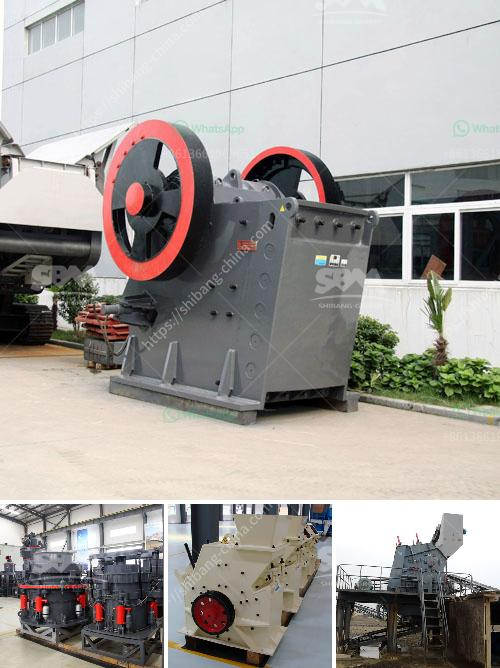

<h3>limestone processing crusher</h3>
Limestone is a sedimentary rock composed mainly of calcium carbonate (CaCO3). It is an abundant and widely distributed rock, forming at the bottom of lakes and oceans. Limestone can be categorized into two main types – primary and secondary. Primary limestone forms as a result of chemical precipitation, such as the deposition of calcium carbonate from lake or ocean water. Secondary limestone forms from the accumulation of fragments of shells, coral, and other marine organisms.

Limestone has various applications in different industries, including construction, agriculture, and manufacturing. One of the most common uses of limestone is as a crushed stone for roadbase and concrete aggregate. It is also used as a filler material in the production of asphalt and cement. Limestone is an essential ingredient in the manufacturing of glass, steel, and lime, which is used in a variety of industrial processes.

In order to obtain the desired limestone products, it is necessary to crush the limestone rock to a specific size through a crushing process in a limestone processing crusher. While limestone is generally not very abrasive, it can still cause significant wear on crushing equipment. Therefore, it is necessary to select a crusher with wear-resistant components that can withstand the abrasion caused by the limestone.

There are several types of crushers that can be used in the limestone crushing process. The most common ones are jaw crushers, impact crushers, cone crushers, and hammer crushers. Each crusher has different features and advantages, so it is important to choose the right one based on the specific requirements of the application.

Jaw crushers are primarily used for coarse crushing and have a large feed opening that can accommodate large-sized limestone rocks. They produce minimal fines and have excellent particle shape, making them suitable for crushing hard and abrasive materials.

Impact crushers, on the other hand, are commonly used for secondary crushing. They have a high reduction ratio and can produce fine-sized end products. Impact crushers are ideal for crushing medium-hard to hard materials, including limestone.

Cone crushers are often used for intermediate crushing, as they provide a very consistent product shape. They have a high reduction ratio and can produce cubical-shaped end products. Cone crushers are suitable for both primary and secondary crushing.

Hammer crushers are suitable for crushing brittle materials, such as limestone, in cement plants. They have a high reduction ratio and can produce cubic-shaped end products. Hammer crushers are mainly used in the production of cement and other similar industries.

In conclusion, limestone processing crushers are essential equipment in limestone processing, encompassing various stages such as coarse crushing, intermediate crushing, and fine crushing. Different types of crushers can be selected according to the specific requirements of the application, resulting in the desired limestone products for various industries. It is important to choose a crusher with wear-resistant components to withstand the abrasion caused by the limestone, ensuring long-lasting and efficient operation.
<h3>Contact us</h3><ul><li><strong>Whatsapp:&nbsp;<a href="https://wa.me/8613661969651">+8613661969651</a></strong></li><li><a href="https://swt.shibang-china.com/?git&amp;zhl&amp;limestone processing crusher"><strong>Online Service(chat now)</strong></a></li></ul><h3>Related</h3><ul><li><a href='sale of crushers in malaysia.md'>sale of crushers in malaysia</a></li><li><a href='pebbel stone crusher.md'>pebbel stone crusher</a></li><li><a href='quartz powder manufacturing equipments.md'>quartz powder manufacturing equipments</a></li><li><a href='stone crushers suppliers.md'>stone crushers suppliers</a></li><li><a href='100tph stone crusher.md'>100tph stone crusher</a></li></ul>