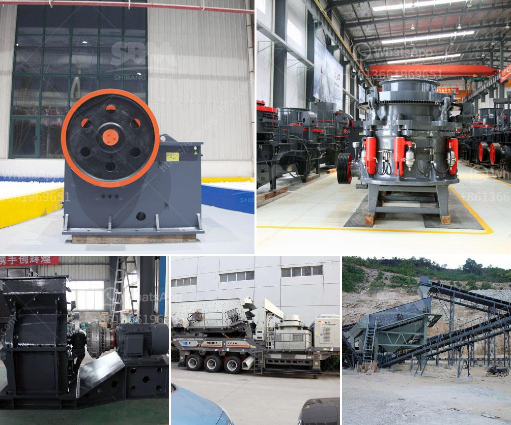

<h3>limestone processing limestone processing plant</h3>
Limestone is a sedimentary rock composed mostly of calcium carbonate (CaCO3). It is a primary ingredient in the production of construction materials like cement, plaster, and limestone aggregate. The processing of limestone involves several steps, including crushing, grinding, calcining, and hydration. These processes convert the raw limestone into a product that is suitable for various industrial applications.

The first step in limestone processing is crushing. This involves breaking the limestone into smaller pieces to make it easier to handle and transport. The crushed limestone is then screened to separate the different sizes of stone. After screening, the stone is conveyed to a crusher to further reduce its size.

Next, the crushed limestone is ground into a powder in a combination of grinding mills. The fine limestone powder is then separated and collected in cyclones. The grinding process enhances the chemical reactivity of the limestone by increasing its surface area. This makes the limestone more reactive when it comes into contact with other materials during subsequent stages of processing.

After grinding, the limestone powder is then calcined in a kiln. In this process, the limestone is heated to a high temperature (around 1000 degrees Celsius) to remove moisture and carbon dioxide, resulting in a product called quicklime (CaO). The calcination process also causes the limestone to undergo a physical transformation, known as thermal decomposition, which enhances its chemical properties. Quicklime is used in a variety of industrial applications, including steel making, water treatment, and the production of lime mortar and plaster.

The final step in limestone processing is hydration. This involves adding water to the quicklime to produce hydrated lime (Ca(OH)2). Hydrated lime is used in various applications, including soil stabilization, waste water treatment, and as an additive in asphalt and concrete. It is also commonly used in the production of paper, plastics, and chemicals.

To facilitate the processing of limestone, many companies operate limestone processing plants. These plants are equipped with specialized equipment and machinery to handle the different stages of limestone processing. For example, crushers and grinding mills are used in the crushing and grinding stages, while kilns and hydration units are used in the calcination and hydration stages. Advanced technologies and automation systems are also employed to ensure efficient and precise operations.

In conclusion, limestone processing is a complex and vital process that is essential for the production of various construction materials and industrial products. The processing of limestone involves crushing, grinding, calcining, and hydration, which convert the raw limestone into a usable product. Limestone processing plants play a crucial role in this process by providing the necessary equipment and machinery. With advanced technologies and automation, these plants ensure efficient and high-quality limestone processing, contributing to the development of various industries.
<h3>Contact us</h3><ul><li><strong>Whatsapp:&nbsp;<a href="https://wa.me/8613661969651">+8613661969651</a></strong></li><li><a href="https://swt.shibang-china.com/?git&amp;zhl&amp;limestone processing limestone processing plant"><strong>Online Service(chat now)</strong></a></li></ul><h3>Related</h3><ul><li><a href='chromium ore mining equipmentr.md'>chromium ore mining equipmentr</a></li><li><a href='limestone processing limestone processing plant.md'>limestone processing limestone processing plant</a></li><li><a href='ball mill turkey fabricant.md'>ball mill turkey fabricant</a></li><li><a href='basalt production machinery.md'>basalt production machinery</a></li><li><a href='stone crusher primary jaw to buy in nigeria.md'>stone crusher primary jaw to buy in nigeria</a></li></ul>