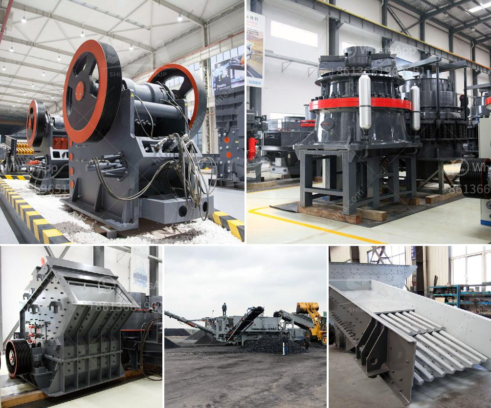

<h3>limestone processing plant price list</h3>
Limestone is a common sedimentary rock composed mainly of calcium carbonate (CaCO3). It is formed by the remains of shells and skeletons of marine organisms, such as coral. Limestone has various industrial uses, including as a raw material for cement, agriculture, and construction.

Setting up a limestone processing plant requires significant investment. However, the benefits of having access to a reliable supply of limestone make it a worthwhile venture for many businesses. When considering the price list for setting up a limestone processing plant, several factors come into play.

Firstly, the location of the limestone deposit plays a crucial role in determining the price. Transporting limestone over long distances can be costly, so having a plant near the source of limestone can save on transportation costs. Additionally, the availability of infrastructure, such as roads and utilities, in the area can affect the overall investment required.

Secondly, the scale of the plant also affects the price. A larger plant will require more equipment, machinery, and manpower, leading to higher costs. However, a larger plant can also achieve economies of scale, resulting in lower production costs over time.

Furthermore, the technology and equipment used in the processing plant impact the price. Modern technology allows for more efficient and cost-effective processing methods. Advanced machinery can increase productivity and reduce energy consumption, thereby lowering the overall operational costs.

Lastly, the environmental regulations and permits needed for operating a limestone processing plant should be considered. Compliance with environmental standards can require additional investments in pollution control measures and waste disposal systems.

Considering these factors, it is recommended to consult with industry experts and suppliers to obtain a comprehensive price list for a limestone processing plant. They can provide detailed estimates based on specific project requirements, ensuring that all necessary elements are accounted for.

In conclusion, setting up a limestone processing plant requires careful consideration of various factors that influence the price. These include the location, scale, technology, and environmental requirements. By conducting thorough research and obtaining price lists from trusted sources, businesses can make informed decisions and ensure a successful investment in a limestone processing plant.
<h3>Contact us</h3><ul><li><strong>Whatsapp:&nbsp;<a href="https://wa.me/8613661969651">+8613661969651</a></strong></li><li><a href="https://swt.shibang-china.com/?git&amp;zhl&amp;limestone processing plant price list"><strong>Online Service(chat now)</strong></a></li></ul><h3>Related</h3><ul><li><a href='6inch rock crushing mill in guatemala.md'>6inch rock crushing mill in guatemala</a></li><li><a href='machinery required for marble quarry crusher.md'>machinery required for marble quarry crusher</a></li><li><a href='small grinding mill machine in india.md'>small grinding mill machine in india</a></li><li><a href='companies rent vibrating screens.md'>companies rent vibrating screens</a></li><li><a href='hammer mill crusher batubara.md'>hammer mill crusher batubara</a></li></ul>