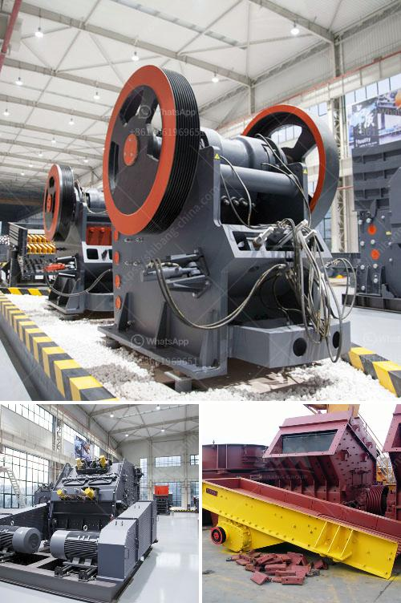

<h3>limestone quarry operations</h3>
Limestone quarry operations are an important part of many industrial and construction projects. In fact, limestone has been utilized for centuries as a versatile building material. Limestone is a rock composed primarily of calcium carbonate, and its extraction and processing are integral in facilitating countless construction processes.

Limestone quarry operations typically involve a combination of drilling, blasting, and crushing activities. The extraction of limestone from the earth’s crust can be highly detrimental to the surrounding ecosystem and may lead to the extinction of certain species in the area. As such, environmental concerns are of paramount importance in the day-to-day operations of limestone quarries.

To mitigate the potentially negative impacts, many quarries adhere to strict environmental regulations. Prior to commencing operations, comprehensive environmental impact assessments are carried out to identify and develop appropriate control measures. These measures might include the establishment of buffer zones, the installation of noise barriers, and regular monitoring and reporting of air and water quality.

The first step in limestone quarry operations is the removal of overburden, which refers to the soil and rocks that lie above the limestone deposit. Overburden is removed using heavy machinery, such as bulldozers, and dumped into nearby designated areas, often referred to as "overburden piles". These overburden piles are carefully constructed to prevent soil erosion, following the highest environmental guidelines.

Once overburden has been removed, the next step is drilling. Large drill rigs are used to create holes in the ground, which are then filled with explosives. Once the explosives are in place, they are detonated, causing the limestone to fracture and break apart. This process, called blasting, allows for the extraction of limestone more efficiently.

After blasting, front-end loaders or excavators are used to load the broken limestone onto dump trucks, which transport it to the primary crushing station. At the primary crushing station, the limestone is reduced in size by either a jaw or gyratory crusher. The crushed material is then transported to a secondary crushing plant, where it is further reduced in size and prepared for the next step in the process.

The final step in limestone quarry operations is the aggregate production, which involves the screening and sorting of the rock into various sizes for use in different construction applications. This is achieved using specialized equipment such as vibrating screens, crushers, and classifiers.

In conclusion, limestone quarry operations play a crucial role in the construction industry. However, it is important to address and minimize the potential environmental impacts associated with these operations. Stringent regulations and monitoring processes ensure that quarries operate responsibly and sustainably. By doing so, limestone quarries can continue to provide the necessary raw materials for construction projects while protecting the environment.
<h3>Contact us</h3><ul><li><strong>Whatsapp:&nbsp;<a href="https://wa.me/8613661969651">+8613661969651</a></strong></li><li><a href="https://swt.shibang-china.com/?git&amp;zhl&amp;limestone quarry operations"><strong>Online Service(chat now)</strong></a></li></ul><h3>Related</h3><ul><li><a href='second hand conveyor belt adelaide.md'>second hand conveyor belt adelaide</a></li><li><a href='cone crusher manufacturers china.md'>cone crusher manufacturers china</a></li><li><a href='price of granite crusher tons per hour.md'>price of granite crusher tons per hour</a></li><li><a href='salary of crusher operer in philippines.md'>salary of crusher operer in philippines</a></li><li><a href='mobile gold processing plant with price.md'>mobile gold processing plant with price</a></li></ul>