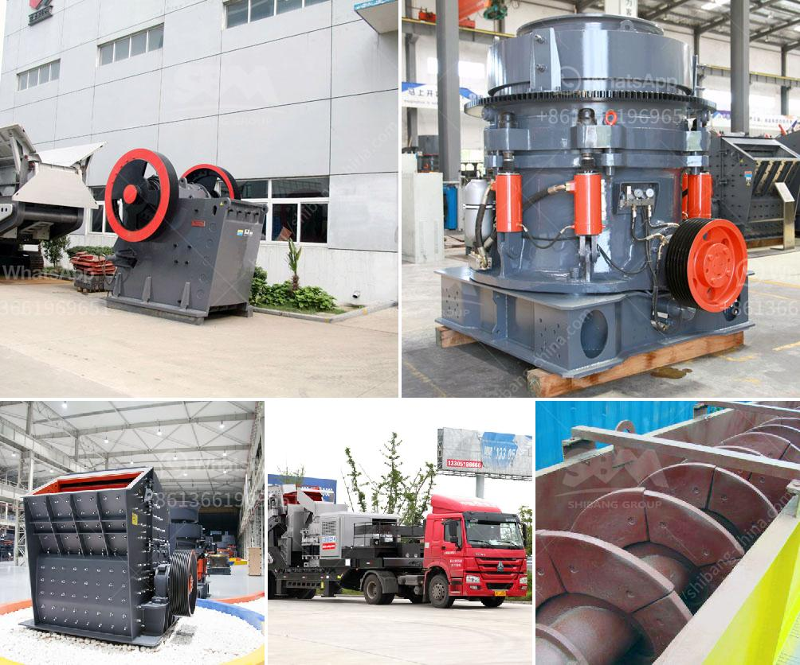

<h3>limestone screen high frequency used</h3>
Limestone is a sedimentary rock that is widely used in the construction industry due to its durability and aesthetic appeal. One of the integral processes in limestone production is screening, which involves separating particles of different sizes to meet the specific requirements of various applications. In recent years, the use of high-frequency screens in limestone screening has gained significant popularity due to their efficiency and accuracy.

A high-frequency screen, also known as an inclined vibrating screen, is a device that utilizes a vibrating motion to separate materials based on their size. Unlike conventional screens, high-frequency screens operate at a higher frequency, typically ranging from 1500 to 7200 RPM. This faster motion allows for finer particle sizes to be separated with increased precision.

One of the key advantages of using a high-frequency screen for limestone screening is its ability to handle large volumes of material. The high-frequency vibration of the screen ensures efficient separation of fine particles, enhancing the overall productivity of the screening process. This is particularly beneficial in industries such as aggregate production, where large quantities of limestone are processed to meet the demand for construction materials.

Furthermore, high-frequency screens offer improved accuracy in particle size classification. With the ability to achieve high-frequency vibrations, these screens can accurately separate particles as fine as 75 microns. This level of precision ensures that the final limestone product meets the required specifications for specific applications, such as road base materials or decorative aggregates for landscaping.

In addition to its efficiency and accuracy, the use of high-frequency screens in limestone screening also offers several operational advantages. These screens are designed to be highly durable and resistant to wear and tear, making them suitable for heavy-duty applications. The robust construction of high-frequency screens ensures their longevity and reduces the need for frequent maintenance, resulting in cost savings for industries utilizing limestone screening.

Another notable benefit of high-frequency screens is their compact design and ease of installation. These screens can be easily integrated into existing processing plants without requiring significant modifications. This versatility enables industries to upgrade their screening systems with minimal disruption to their production processes, optimizing operational efficiency.

Industries that commonly utilize limestone screening, such as the construction, mining, and aggregates sectors, can greatly benefit from the use of high-frequency screens. The high-performance capabilities of these screens enable efficient processing of large volumes of limestone, resulting in increased productivity and cost savings. Moreover, the precise particle size classification achieved by high-frequency screens ensures the production of high-quality limestone products tailored to specific industry requirements.

In conclusion, the use of limestone screen high-frequency technology provides effective solutions for a range of industries. The efficiency, accuracy, durability, and ease of integration offered by high-frequency screens make them an ideal choice for separating limestone particles. With their ability to handle large volumes of material and achieve precise particle size classification, high-frequency screens optimize the limestone screening process, resulting in enhanced productivity and quality within various industrial applications.
<h3>Contact us</h3><ul><li><strong>Whatsapp:&nbsp;<a href="https://wa.me/8613661969651">+8613661969651</a></strong></li><li><a href="https://swt.shibang-china.com/?git&amp;zhl&amp;limestone screen high frequency used"><strong>Online Service(chat now)</strong></a></li></ul><h3>Related</h3><ul><li><a href='single super phosphate plants in germany.md'>single super phosphate plants in germany</a></li><li><a href='diamond plant for sale in south africa.md'>diamond plant for sale in south africa</a></li><li><a href='calcium carbide making machine used.md'>calcium carbide making machine used</a></li><li><a href='raymond mill in kenya.md'>raymond mill in kenya</a></li><li><a href='india grinding machine for talcum powder.md'>india grinding machine for talcum powder</a></li></ul>