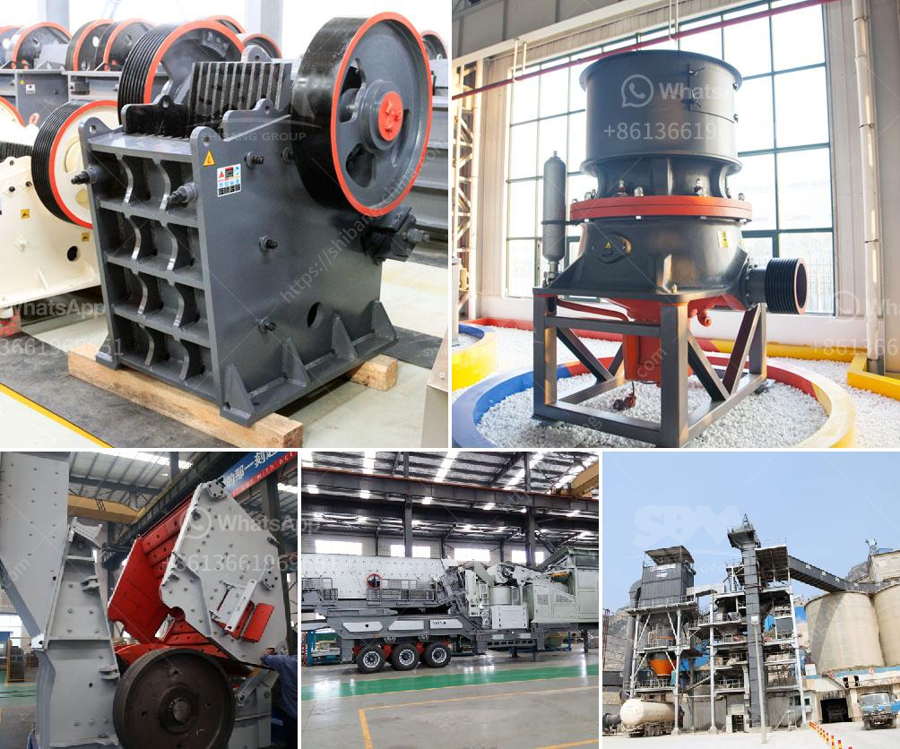

<h3>list of concrete products manufacturers in ethiopia</h3>
Ethiopia, a rapidly developing country in East Africa, has made significant strides in its construction industry in recent years. As a result, the demand for high-quality concrete products has grown exponentially. To meet this demand, numerous manufacturers have emerged in the country, offering a wide range of concrete products for various construction needs.

One of the leading manufacturers in Ethiopia is Derba MIDROC Cement PLC. Established in 2007, Derba MIDROC Cement has become a major player in the cement and concrete industry. They produce an array of concrete products, including blocks, pavers, and precast concrete panels. With a state-of-the-art manufacturing facility located in Dukem, near the capital city Addis Ababa, Derba MIDROC Cement ensures that the products meet the highest standards of quality and durability.

Another prominent manufacturer is Habesha Cement Share Company. Known for its high-quality cement, Habesha Cement has expanded its product line to include various concrete products. They provide different types of blocks, such as hollow and solid blocks, as well as interlocking pavers. With a commitment to sustainable production practices, Habesha Cement ensures that their products not only meet construction needs but also contribute to environmental conservation.

Ethiopian Precast Concrete Manufacturing PLC (EPCM), established in 2016, is another key player in the industry. They specialize in manufacturing precast concrete products, such as boundary wall panels, slabs, and beams. EPCM is known for their innovative approach and ability to provide customized solutions to meet specific project requirements. With a dedicated team of professionals and a modern production facility, EPCM aims to play a significant role in Ethiopia's infrastructure development.

Tilahun Bethlehem Manufacturing PLC is a notable manufacturer of concrete products in Ethiopia. They focus on producing hollow blocks, paving stones, and precast concrete products. With a large production capacity and a network of distribution channels, Tilahun Bethlehem Manufacturing PLC ensures timely delivery of their products to construction sites across the country. Furthermore, they prioritize customer satisfaction by offering a wide range of design options and delivering products that comply with international standards.

Ethio Cement PLC, established in 2014, is also worth mentioning among concrete products manufacturers in Ethiopia. They produce a variety of concrete products, including blocks, pavers, and kerbstones. Ethio Cement places emphasis on using advanced technology and modern manufacturing techniques to ensure the quality and consistency of their products.

In conclusion, Ethiopia's construction industry has witnessed significant growth, leading to a surge in demand for concrete products. This has prompted the emergence of several manufacturers in the country. Companies like Derba MIDROC Cement, Habesha Cement Share Company, Ethiopian Precast Concrete Manufacturing PLC (EPCM), Tilahun Bethlehem Manufacturing PLC, and Ethio Cement PLC are playing a pivotal role in meeting this demand. With their focus on quality, innovation, and customer satisfaction, these manufacturers are contributing to the country's infrastructure development and economic growth.
<h3>Contact us</h3><ul><li><strong>Whatsapp:&nbsp;<a href="https://wa.me/8613661969651">+8613661969651</a></strong></li><li><a href="https://swt.shibang-china.com/?git&amp;zhl&amp;list of concrete products manufacturers in ethiopia"><strong>Online Service(chat now)</strong></a></li></ul><h3>Related</h3><ul><li><a href='ultrafine grinding mill.md'>ultrafine grinding mill</a></li><li><a href='turkish manufacturer belt conveyor.md'>turkish manufacturer belt conveyor</a></li><li><a href='dealing in portable crusher machine.md'>dealing in portable crusher machine</a></li><li><a href='quartz stone crusher application.md'>quartz stone crusher application</a></li><li><a href='iron ore processing plant.md'>iron ore processing plant</a></li></ul>