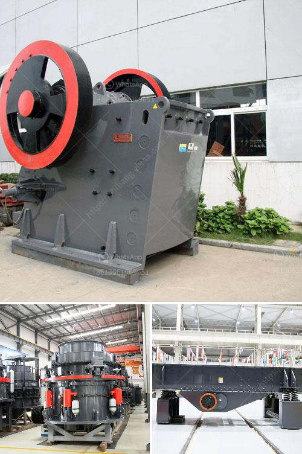

<h3>list of gold mining company in zimbabwe</h3>
Zimbabwe, a landlocked country located in Southern Africa, is known for its diverse wildlife and natural resources. It has a rich history of mining, with gold being one of the most important minerals found in the country.

The majority of the country's gold reserves are located in the prolific Archaean Greenstone Belts of Zimbabwe. With more than 30 known deposits, Zimbabwe has the second-largest gold reserves per square kilometer in the world. These greenstone belts are also home to some of the oldest mines in the world, dating back to the time of ancient civilizations.

Most of the gold mining companies in Zimbabwe are owned by foreign investors and some of them are based in Canada and South Africa. These investors include individual investors as well as international gold mining companies. Some of the top gold mining companies in Zimbabwe include Metallon Corporation, Caledonia Mining Corporation, Blanket Gold Mine, and Freda Rebecca Gold Mine.

Metallon Corporation is the largest gold mining company in Zimbabwe and operates four mines throughout the country. The company, founded in 2002 when Zimbabwe's gold mining industry was struggling to survive, is privately-owned and listed on the London Stock Exchange. Metallon Corporation operates the Redwing Mine, the Shamva Mine, the Mazowe Mine, and the Arcturus Mine, all of which are located in the southern part of the country.

Caledonia Mining Corporation is another major player in Zimbabwe's gold mining industry. The company owns and operates the Blanket Gold Mine, which is located in the southwest of Zimbabwe. The mine has been in operation since the late 19th century and is currently producing gold at an annual rate of approximately 54,000 ounces. Caledonia Mining Corporation is listed on the Toronto Stock Exchange and is focused on expanding its operations in Zimbabwe.

Freda Rebecca Gold Mine is another well-known gold mining company in Zimbabwe, located close to Bindura Town in the Mashonaland Central Province. Freda Rebecca is owned by Asa Resource Group, an international mining and mineral processing company with a diverse portfolio of mining operations across several countries. The mine has been in operation since 1988 and has produced more than 1.5 million ounces of gold to date.

In addition to these major gold mining companies, there are several other small-scale miners that operate in Zimbabwe. These include artisanal and small-scale miners who engage in mining activities using basic tools and equipment. Small-scale mining plays a crucial role in Zimbabwe's gold production as it contributes significantly to the country's overall mineral output.

Despite the economic challenges faced by Zimbabwe, the country's gold mining industry remains a key pillar of its economy. The gold mining sector contributes significantly to employment creation and foreign exchange earnings, making it a vital sector for the country's economic growth.

In conclusion, Zimbabwe is home to several gold mining companies, both large and small-scale. These companies play a significant role in the country's gold production, contributing to employment creation and foreign exchange earnings. With its rich history of gold mining and vast reserves, Zimbabwe has the potential to become a major player in the global gold mining industry.
<h3>Contact us</h3><ul><li><strong>Whatsapp:&nbsp;<a href="https://wa.me/8613661969651">+8613661969651</a></strong></li><li><a href="https://swt.shibang-china.com/?git&amp;zhl&amp;list of gold mining company in zimbabwe"><strong>Online Service(chat now)</strong></a></li></ul><h3>Related</h3><ul><li><a href='stone crusher sample business plan.md'>stone crusher sample business plan</a></li><li><a href='impact crusher manufacturers in germany.md'>impact crusher manufacturers in germany</a></li><li><a href='cost of jaw crusher in kenya.md'>cost of jaw crusher in kenya</a></li><li><a href='used stone crushers in south korea.md'>used stone crushers in south korea</a></li><li><a href='biggest cone crusher in africa.md'>biggest cone crusher in africa</a></li></ul>