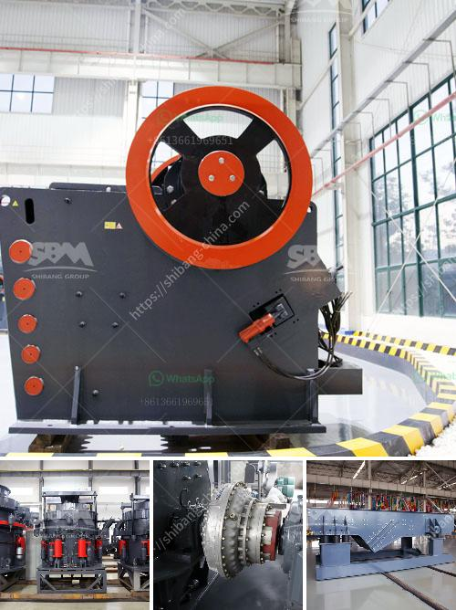

<h3>list of major equipments in setting up a quarry business</h3>
Setting up a quarry business is a lucrative opportunity for entrepreneurs. However, it requires a significant investment in equipment, machinery, and manpower. In this article, we will discuss the list of major equipment needed to start a quarry business.

Excavators: Excavators are essential machines in any quarry operation. They are used for a variety of tasks, such as digging the ground, removing overburden, and extracting the desired materials. The size and capacity of the excavators will depend on the scale of the quarry and the volume of material to be extracted.

Dump trucks: Dump trucks are used to transport materials from the quarry site to designated storage areas or construction sites. These trucks come in different sizes and capacities, ranging from small tipper trucks to large articulated trucks capable of carrying heavy loads.

Bulldozers: Bulldozers are powerful machines that are used for various tasks, including earthmoving, leveling the ground, and pushing heavy materials. In a quarry business, bulldozers are primarily used to clear the site and create access roads.

Wheel loaders: Wheel loaders are versatile machines that can be used for loading and transporting materials within the quarry site. They are commonly used to move aggregates, sand, and other extracted materials from one location to another.

Crushers: Crushers are crucial equipment in the quarrying process, as they break down large rocks into smaller sizes. Different types of crushers are available, including jaw crushers, gyratory crushers, impact crushers, and cone crushers. The choice of crusher will depend on the desired product size and the hardness of the material.

Screeners: Screeners are used to separate different sizes of crushed materials and ensure uniformity in the final product. They can be vibrating screens or trommel screens, depending on the specific requirements of the quarry business.

Conveyors: Conveyors are used to transport materials efficiently within the quarry site. They can be stationary or mobile, and they are essential for moving materials from the extraction point to processing areas or storage facilities.

Drilling equipment: Drilling is an important process in quarrying, as it is used to create blast holes for the extraction of materials. Different types of drills, such as rotary drills and top hammer drills, are used depending on the hardness and depth of the material.

Water trucks: Water trucks are essential for suppressing dust in the quarry site. They ensure a safe working environment for employees and prevent contamination of nearby areas. These trucks are equipped with a water tank and a spraying mechanism.

Safety equipment: Safety should be a top priority in any quarry business. Personal protective equipment, such as helmets, goggles, gloves, and safety boots, should be provided to all workers. Moreover, safety signs, barriers, and fire extinguishers should be installed within the quarry site.

In conclusion, setting up a quarry business requires a range of major equipment to facilitate the extraction, processing, and transportation of materials. Excavators, dump trucks, bulldozers, wheel loaders, crushers, screeners, conveyors, drilling equipment, water trucks, and safety equipment are some of the key machinery needed for a successful quarry business. Investing in high-quality and reliable equipment is crucial to ensure smooth operation and maximize profits in the long run.
<h3>Contact us</h3><ul><li><strong>Whatsapp:&nbsp;<a href="https://wa.me/8613661969651">+8613661969651</a></strong></li><li><a href="https://swt.shibang-china.com/?git&amp;zhl&amp;list of major equipments in setting up a quarry business"><strong>Online Service(chat now)</strong></a></li></ul><h3>Related</h3><ul><li><a href='coal processing plant in philippines.md'>coal processing plant in philippines</a></li><li><a href='ball mill in romania.md'>ball mill in romania</a></li><li><a href='magnetic separator distributor in surabaya.md'>magnetic separator distributor in surabaya</a></li><li><a href='stone crushing machine in china.md'>stone crushing machine in china</a></li><li><a href='how much cost to build a 50 ton cement plant.md'>how much cost to build a 50 ton cement plant</a></li></ul>