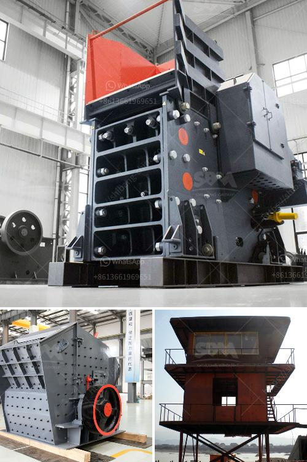

<h3>list of quarry company in the philippines</h3>
The Philippines is a country rich in natural resources and minerals, and has a large mining industry. With numerous operating mines and quarries in various parts of the country, this industry contributes significantly to the Philippine economy.

In terms of employment, the local mining and quarrying sector employs an estimated 500,000 individuals. This is a substantial number given the sector's importance in mineral extraction and in supporting other industries that rely on raw materials.

1. Republic Aggregates and Mining Corporation - this company is a leading supplier of construction materials and aggregates in Luzon, Visayas, and Mindanao. It focuses on quarrying, crushing, and selling aggregates to the construction industry.

2. Apo Land and Quarry Corporation - this company was established in 1964 and operates a quarry in Cebu. It sells limestone, aggregates, and other construction materials directly to contractors and individuals.

3. Montalban Millex Aggregates Corporation - this company is located in Rodriguez, Rizal and operates a quarrying and crushing plant. It sells aggregates for construction purposes and currently holds a permit issued by the Mines and Geosciences Bureau (MGB) to extract and process materials up to 2023.

4. C.O. Williams Construction Inc. - this company specializes in the production of crushed stone, sand, and gravel used for construction and infrastructure projects. It operates several quarries in the Philippines, including a limestone mining project in Palawan.

5. Vulcan Materials Corporation - this company is one of the biggest quarry operators in the world. It operates in the Philippines through its subsidiary, Vulcan Materials Philippines Inc. It produces and sells crushed stone, sand, gravel, and other construction aggregates.

6. Solid Group, Inc. - this company is engaged in quarrying and sells raw materials necessary for construction, such as sand, gravel, and aggregates.

These quarry companies play a critical role in the country's development. They provide the essential raw materials needed for construction projects, infrastructure development, and building homes. Without their operations, the country's progress would be greatly hampered.

However, it is also important to ensure that quarrying activities are conducted responsibly and sustainably. The responsible extraction of natural resources is crucial to preserve and protect the environment. Local government authorities and environmental agencies need to work closely with quarry companies to ensure compliance with regulations and minimize the negative impact on the surrounding ecosystems.

In conclusion, the quarrying industry in the Philippines is an essential part of the country's economy, providing employment opportunities and contributing to infrastructure development. The list of quarry companies mentioned above highlights the significant role they play in the local mining and construction sectors.
<h3>Contact us</h3><ul><li><strong>Whatsapp:&nbsp;<a href="https://wa.me/8613661969651">+8613661969651</a></strong></li><li><a href="https://swt.shibang-china.com/?git&amp;zhl&amp;list of quarry company in the philippines"><strong>Online Service(chat now)</strong></a></li></ul><h3>Related</h3><ul><li><a href='dolomite crushing plant in bharuch.md'>dolomite crushing plant in bharuch</a></li><li><a href='dolomite crushing plant price in india.md'>dolomite crushing plant price in india</a></li><li><a href='marble stone powder manufacturer in pakistan.md'>marble stone powder manufacturer in pakistan</a></li><li><a href='used stone crusher machine for sale in philippines.md'>used stone crusher machine for sale in philippines</a></li><li><a href='150 tpd cement line price.md'>150 tpd cement line price</a></li></ul>