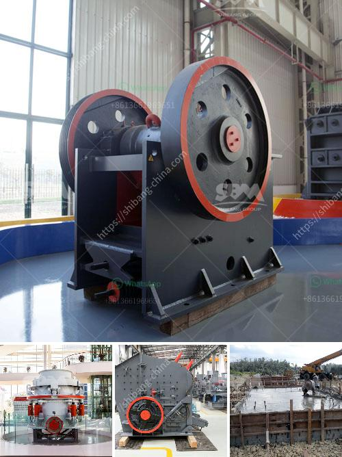

<h3>lister petter maize hammer mills</h3>
For farmers who need an efficient and reliable grinding solution, Lister Petter's maize hammer mills provide a cost-effective way to produce quality animal feed. These hammer mills are designed to grind maize into various sizes, ranging from coarse to fine, to meet the specific demands of the poultry, livestock, and aquaculture industries.

One of the key benefits of the Lister Petter maize hammer mills is their versatility. These robust machines can handle a variety of materials, making them suitable for grinding not only maize but also other grains, such as barley, oats, wheat, and sorghum. This versatility allows farmers to diversify their animal feed production and meet the nutritional needs of different animals.

With a capacity ranging from 100 to 300 kilograms per hour, Lister Petter maize hammer mills are ideal for small and medium-scale farmers. The mills are easily operated and maintained, ensuring hassle-free operation and minimizing downtime. Additionally, they are compact and portable, making them suitable for on-site grinding or for farmers who need to move their operations frequently.

Lister Petter has a long-standing reputation for producing reliable agricultural machinery, and their maize hammer mills are no exception. These mills are built to last, with sturdy construction and high-quality materials. They are designed to withstand the rigors of daily use without compromising performance.

In terms of performance, Lister Petter maize hammer mills deliver consistent grind sizes, ensuring that the animal feed is uniform and of high quality. This is essential for animal health and productivity, as inconsistent grind sizes can affect digestion and nutrient absorption.

In conclusion, Lister Petter maize hammer mills are a reliable and efficient solution for grinding maize and other grains into quality animal feed. These versatile machines are suitable for small and medium-scale farmers, offering them a cost-effective way to produce nutritious feed for their livestock. With their robust construction, easy operation, and consistent performance, Lister Petter maize hammer mills are a valuable asset for any farming operation.
<h3>Contact us</h3><ul><li><strong>Whatsapp:&nbsp;<a href="https://wa.me/8613661969651">+8613661969651</a></strong></li><li><a href="https://swt.shibang-china.com/?git&amp;zhl&amp;lister petter maize hammer mills"><strong>Online Service(chat now)</strong></a></li></ul><h3>Related</h3><ul><li><a href='process of gravel quarrying crusher.md'>process of gravel quarrying crusher</a></li><li><a href='calculation coal crusher.md'>calculation coal crusher</a></li><li><a href='chrome ore price in south africa.md'>chrome ore price in south africa</a></li><li><a href='small sacle crushers in zambia.md'>small sacle crushers in zambia</a></li><li><a href='crushing plants for sale in sri lanka.md'>crushing plants for sale in sri lanka</a></li></ul>