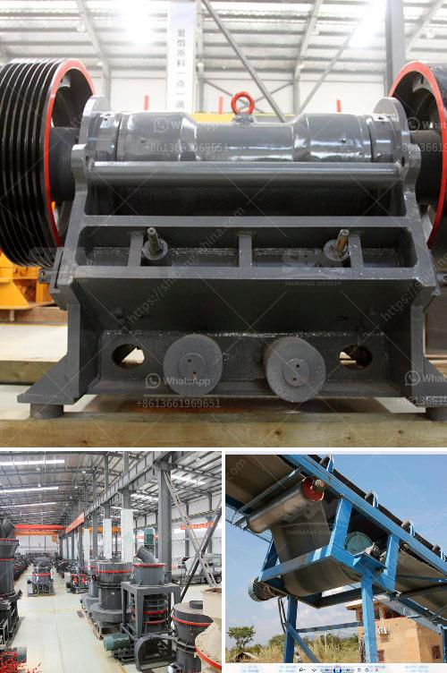

<h3>low speed crusher suppliers in china</h3>
Plastic waste has become a global environmental crisis, with millions of tons accumulating in landfills and polluting our oceans. As the demand for plastic products continues to rise, the need for effective recycling technologies becomes paramount. One such technology is the low speed crusher, which plays a crucial role in breaking down plastic waste into smaller pieces for easier recycling. In China, there are several suppliers of low speed crushers that are revolutionizing the plastic recycling industry.

A low speed crusher, also known as a low-speed granulator, is a crushing machine used for size reduction of plastic waste. This type of crusher operates at a low rotational speed, which results in a larger cutting force and increased torque. The primary purpose of a low speed crusher is to reduce the size of plastic waste and facilitate recycling. By breaking down plastic waste into smaller pieces, it becomes easier to process and reuse the material to produce new products.

In recent years, China has emerged as a global leader in plastic recycling due to its large-scale manufacturing industry. The country has experienced rapid economic growth, resulting in a significant increase in plastic waste generation. To tackle this issue, Chinese suppliers of low speed crushers have been working diligently to provide efficient and reliable machines to the plastic recycling industry.

One such supplier is ABC Machinery, based in Zhengzhou, China. The company specializes in the production of low-speed crushers and other recycling machinery. With years of experience in the industry, ABC Machinery has developed cutting-edge technology that ensures high-performance and energy-efficient crushers. Their machines are designed to handle various types of plastic waste, including PET bottles, PE films, and PVC pipes. In addition to supplying crushers, ABC Machinery also provides comprehensive after-sales service and technical support to ensure customer satisfaction.

Another prominent supplier is GREENMAX, known for their expertise in developing foam densifiers and recycling machines. GREENMAX offers a range of low-speed crushers that are specifically designed for crushing foam waste. Their crushers can handle a wide variety of foam materials, including expanded polystyrene (EPS), extruded polystyrene (XPS), and polyethylene foam (PE foam). By providing effective solutions for foam waste recycling, GREENMAX is contributing to the reduction of plastic pollution globally.

In addition to ABC Machinery and GREENMAX, there are several other Chinese suppliers of low speed crushers that are making significant contributions to the plastic recycling industry. These suppliers focus on continuous innovation and research to develop more efficient and eco-friendly machines. They are also actively involved in promoting awareness about plastic waste management and the benefits of recycling.

In conclusion, low speed crusher suppliers in China are playing a crucial role in revolutionizing the plastic recycling industry. Their machines are essential in breaking down plastic waste into smaller pieces for easier recycling. With their cutting-edge technology and commitment to sustainability, these suppliers are paving the way for a cleaner and greener future. By investing in low speed crushers from reputable suppliers, we can collectively contribute to a more sustainable and responsible approach to plastic waste management.
<h3>Contact us</h3><ul><li><strong>Whatsapp:&nbsp;<a href="https://wa.me/8613661969651">+8613661969651</a></strong></li><li><a href="https://swt.shibang-china.com/?git&amp;zhl&amp;low speed crusher suppliers in china"><strong>Online Service(chat now)</strong></a></li></ul><h3>Related</h3><ul><li><a href='graphite manufacturing plant.md'>graphite manufacturing plant</a></li><li><a href='crawler portable crusher.md'>crawler portable crusher</a></li><li><a href='granite crusher machine philippines.md'>granite crusher machine philippines</a></li><li><a href='hammer mill equipment south africa price.md'>hammer mill equipment south africa price</a></li><li><a href='bentonite grinding machines price.md'>bentonite grinding machines price</a></li></ul>