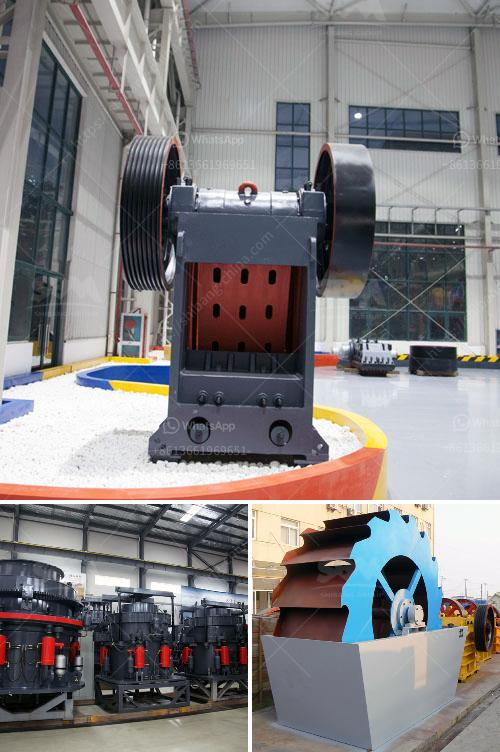

<h3>m sand crushing manufacturers in india</h3>
M Sand, also known as manufactured sand, is one of the most viable alternatives to natural sand. With the increase in construction activities across the country, the demand for sand has risen sharply and is likely to continue escalating in the foreseeable future. To meet this growing demand and address the issue of environmental degradation caused by excessive sand mining, many crushing manufacturers in India have come forward to produce high-quality M Sand.

M Sand is produced by crushing hard stones into fine particles of specific sizes. These particles are classified into different grades based on their size and used in various construction activities, such as concrete production, plastering, and brickwork. The key advantage of using M Sand is that it is free from impurities such as clay, silt, and organic materials, which might affect the strength and durability of construction materials.

In India, numerous manufacturers have set up crushing plants to produce M Sand. The machinery involved in these plants ensures efficient crushing of hard stones into fine particles of various sizes. This not only helps in meeting the demand for sand but also ensures consistent quality throughout the production process.

One of the prominent M Sand crushing manufacturers in India is Propel Industries. It uses state-of-the-art technology to produce high-quality M Sand. The company has a team of highly skilled professionals who monitor the entire production process to ensure the finest quality of sand is produced. Furthermore, Propel Industries also focuses on environmental sustainability by minimizing dust and noise pollution during the crushing process.

Another leading manufacturer in India is Laxmi En-Fab Pvt. Ltd. They specialize in producing M Sand crushers that are highly efficient and environmentally friendly. Their crushers are equipped with advanced technology and designed to ensure optimal crushing efficiency, reducing the percentage of fines in the final product.

With the increasing awareness about the harmful effects of excessive sand mining, the demand for M Sand crushing manufacturers in India is only expected to rise. These manufacturers play a crucial role in meeting the sand demand in a sustainable and environmentally friendly manner. By utilizing advanced technology and maintaining strict quality control measures, they ensure that the produced M Sand meets the required specifications, contributing to the growth of India's construction industry while protecting the environment.
<h3>Contact us</h3><ul><li><strong>Whatsapp:&nbsp;<a href="https://wa.me/8613661969651">+8613661969651</a></strong></li><li><a href="https://swt.shibang-china.com/?git&amp;zhl&amp;m sand crushing manufacturers in india"><strong>Online Service(chat now)</strong></a></li></ul><h3>Related</h3><ul><li><a href='mining vibrating screen for sale.md'>mining vibrating screen for sale</a></li><li><a href='machine de lavage a lattrition du sable de silice.md'>machine de lavage a lattrition du sable de silice</a></li><li><a href='iron processing machine price.md'>iron processing machine price</a></li><li><a href='hammer mill of 1 ton per hour.md'>hammer mill of 1 ton per hour</a></li><li><a href='gypsum board production process.md'>gypsum board production process</a></li></ul>