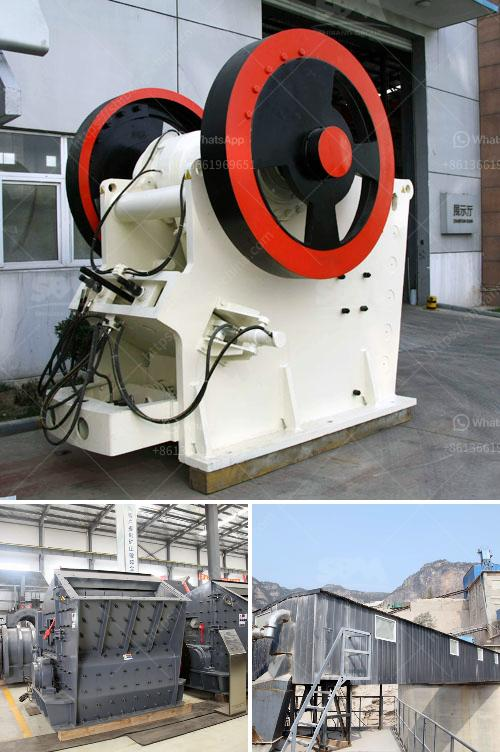

<h3>m sand manufacturing machine</h3>
Over the years, nature has gifted us with an abundance of natural resources. One such resource is sand, which has been a crucial element in construction activities. However, the increasing demand for sand, coupled with the depletion of natural resources, has led to an environmental crisis.

To combat this problem, the construction industry has turned to an innovative solution called M Sand Manufacturing Machine. M Sand, also known as manufactured sand, is an alternative to river sand, which is obtained by crushing stones into fine sand particles. This artificial sand is gaining popularity due to its superior quality, durability, and eco-friendly nature.

The M Sand Manufacturing Machine is a state-of-the-art equipment which has been widely used in construction projects of all sizes. It utilizes a combination of rock-on-rock crushing technology and smart automation to produce high-quality sand with a consistent grading and shape. With its ability to consistently produce sand particles within the desired range, the machine eliminates the need for traditional sand washing methods, thereby reducing the environmental impact.

One of the main advantages of this machine is that it can produce sand of various grades, ranging from coarse to fine. This versatility allows builders and contractors to use M Sand for a wide range of applications, including plastering, concrete production, and road construction. The consistent grading and shape of the sand particles also make it ideal for use in concrete, as it enhances the strength and durability of the final product.

Moreover, M Sand is free from impurities such as silt, clay, and organic matter, which are commonly found in river sand. This absence of impurities ensures that the sand does not affect the setting and hardening properties of concrete, resulting in superior quality construction. Additionally, the use of this artificial sand reduces the dependency on river sand, thereby conserving natural resources and protecting fragile ecosystems.

In terms of cost-effectiveness, M Sand proves to be a pocket-friendly alternative to river sand. While the initial investment in the manufacturing machine may seem substantial, the long-term benefits, such as reduced transportation costs and consistent availability, far outweigh the initial expenditure. Moreover, the low moisture content of M Sand reduces the need for additional water during construction, further reducing costs.

With the increasing demand for construction materials, the M Sand Manufacturing Machine has emerged as a game-changer in the industry. Its ability to produce high-quality sand within a short period has made it a preferred choice for many builders and contractors. Moreover, its eco-friendly nature and cost-effectiveness make it an attractive option for sustainable construction practices.

In conclusion, the M Sand Manufacturing Machine has revolutionized the construction industry with its superior quality, durability, and eco-friendly characteristics. By reducing the dependency on river sand and conserving natural resources, it offers a sustainable solution for the growing construction needs. With the advancements in technology, the future of M Sand manufacturing looks promising, as it continues to play a significant role in shaping a greener and more efficient construction industry.
<h3>Contact us</h3><ul><li><strong>Whatsapp:&nbsp;<a href="https://wa.me/8613661969651">+8613661969651</a></strong></li><li><a href="https://swt.shibang-china.com/?git&amp;zhl&amp;m sand manufacturing machine"><strong>Online Service(chat now)</strong></a></li></ul><h3>Related</h3><ul><li><a href='gold ore crushers for sale in india.md'>gold ore crushers for sale in india</a></li><li><a href='mobile dimension stone processing.md'>mobile dimension stone processing</a></li><li><a href='quartz stone crusher plants made in turkey.md'>quartz stone crusher plants made in turkey</a></li><li><a href='chromium ore mining equipmentr.md'>chromium ore mining equipmentr</a></li><li><a href='calculations for belt conveyor structural bents.md'>calculations for belt conveyor structural bents</a></li></ul>