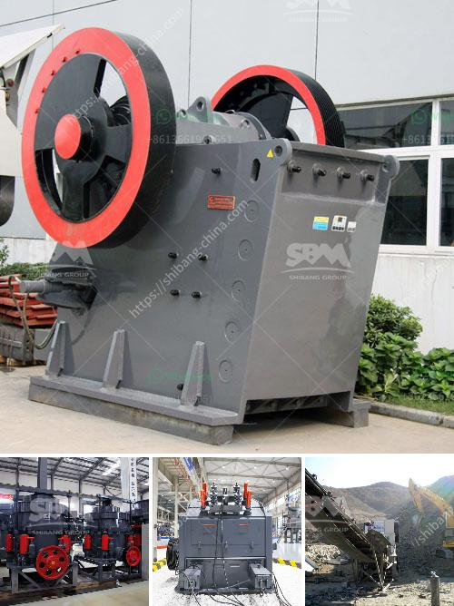

<h3>machine crusher prices in nigeria</h3>
Machine crusher is a multi-dimensional machine designed to crush and size rocks and minerals using mechanical force. It can be used for many applications, including mining, construction, demolition, recycling, and quarrying operations. According to the size and configuration of the machine crusher, the price varies widely.

Nigeria is a country blessed with abundant natural resources and a favorable business environment. However, the lack of proper infrastructure, particularly in the mining sector, has hampered the country's economic development. In recent years, the government has taken steps to encourage foreign investments in the mining industry, leading to increased demand for machine crushers.

The prices of machine crushers in Nigeria are influenced by many factors, including brand, country of origin, specifications, and market demand. In order to buy a suitable crusher, the buyer should consider these factors and compare prices accordingly.

The brand and country of origin of the machine crusher have a significant impact on its price. For instance, a machine crusher manufactured by a Nigerian or Chinese company may be less expensive than a machine crusher manufactured by a European or American company. However, it is important to note that the quality and durability of the machine should not be compromised for a lower price. Investing in a high-quality machine crusher is crucial for long-term efficiency and productivity.

Another important factor to consider is the specifications of the machine crusher. The size and capacity of the machine can vary significantly, depending on the type of material being processed and the desired output size. A larger and more powerful machine crusher will generally have a higher price tag. However, it can also offer higher productivity and better performance, making it a worthwhile investment in the long run.

Furthermore, market demand for machine crushers can influence their prices. If there is a high demand for machine crushers in Nigeria, the prices may go up due to the limited availability of the machines. Conversely, if there is lower demand for machine crushers in the country, the prices may decrease.

In conclusion, machine crusher prices in Nigeria are influenced by factors such as brand, country of origin, specifications, and market demand. It is crucial to compare prices and choose a machine crusher that best suits individual needs and budget. Investing in a high-quality machine crusher is essential for efficient and productive operations in the mining, construction, and demolition industries. With proper research and careful consideration, one can find a reasonably priced machine crusher that offers powerful performance and durability.
<h3>Contact us</h3><ul><li><strong>Whatsapp:&nbsp;<a href="https://wa.me/8613661969651">+8613661969651</a></strong></li><li><a href="https://swt.shibang-china.com/?git&amp;zhl&amp;machine crusher prices in nigeria"><strong>Online Service(chat now)</strong></a></li></ul><h3>Related</h3><ul><li><a href='how to make industrial talcum powder.md'>how to make industrial talcum powder</a></li><li><a href='gold processing mill for sale.md'>gold processing mill for sale</a></li><li><a href='barite crusher plant.md'>barite crusher plant</a></li><li><a href='jaw crusher for hire south africa for limestone.md'>jaw crusher for hire south africa for limestone</a></li><li><a href='coal crushing machine in east rand.md'>coal crushing machine in east rand</a></li></ul>