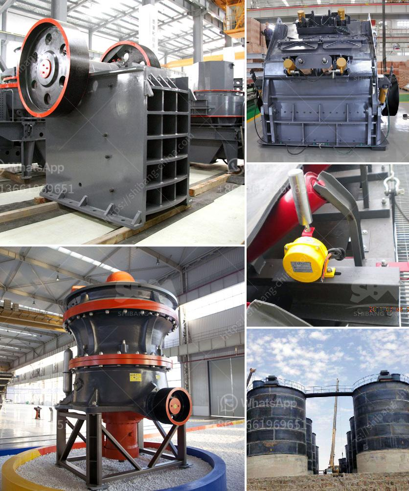

<h3>machine de lavage a lattrition du sable de silice</h3>
Machine de lavage à l'attrition du sable de silice : optimisez votre processus de traitement du sable

Le sable de silice est largement utilisé dans de nombreux secteurs industriels, notamment les industries du verre, de la fonderie, de la construction et des produits chimiques. Cependant, avant son utilisation, il est essentiel de le laver pour éliminer les impuretés et obtenir un produit final de haute qualité. C'est là qu'intervient la machine de lavage à l'attrition du sable de silice.

La machine de lavage à l'attrition du sable de silice est un équipement essentiel dans le processus de traitement du sable de silice. Elle est conçue pour éliminer les impuretés telles que la terre, les argiles et les oxydes de fer, ce qui permet d'obtenir un sable de haute pureté adapté à différentes applications industrielles.

Le principe de fonctionnement de la machine de lavage à l'attrition est simple mais efficace. Le sable de silice est introduit dans un tambour rotatif équipé de pales d'agitation. Sous l'effet du mouvement rotatif du tambour et des pales, les particules de sable frottent les unes contre les autres, ce qui permet de détacher les impuretés adhérant à leur surface.

En outre, cette action de frottement entre les particules de sable entraîne également la réduction de la teneur en particules fines, ce qui améliore encore la qualité du sable de silice lavé. De plus, la machine de lavage à l'attrition peut être réglée pour contrôler l'intensité de l'attrition, ce qui permet d'adapter le procédé de lavage en fonction des différentes exigences de pureté du sable.

Les avantages de l'utilisation de la machine de lavage à l'attrition du sable de silice sont multiples. Tout d'abord, elle offre un haut degré d'efficacité dans le lavage et l'élimination des impuretés, ce qui permet d'obtenir un sable de silice pur et propre en un seul passage. Cela permet de réduire les coûts et les délais de production, tout en améliorant la qualité du produit final.

De plus, la machine de lavage à l'attrition offre une grande flexibilité d'utilisation grâce à ses réglages ajustables. Les paramètres de lavage peuvent être adaptés en fonction des différentes caractéristiques du sable de silice, comme sa granulométrie, sa composition chimique et la nature des impuretés présentes. Cela permet de garantir un lavage optimal pour chaque type de sable et d'obtenir des résultats cohérents et fiables.

Enfin, l'utilisation de la machine de lavage à l'attrition contribue à la préservation de l'environnement. En éliminant efficacement les impuretés du sable de silice, elle réduit la nécessité d'utiliser des produits chimiques agressifs lors du processus de traitement, minimisant ainsi l'impact sur l'environnement et la santé humaine.

En conclusion, la machine de lavage à l'attrition du sable de silice représente une solution efficace pour le processus de traitement du sable. En éliminant les impuretés et en améliorant la qualité du sable de silice, elle permet aux industries de bénéficier d'un matériau de haute pureté adapté à leurs besoins spécifiques. De plus, elle offre une grande flexibilité d'utilisation et contribue à la préservation de l'environnement. Donc, si vous êtes dans l'industrie nécessitant l'utilisation de sable de silice, il est temps d'investir dans une machine de lavage à l'attrition pour maximiser votre efficacité de production et votre qualité de produit.
<h3>Contact us</h3><ul><li><strong>Whatsapp:&nbsp;<a href="https://wa.me/8613661969651">+8613661969651</a></strong></li><li><a href="https://swt.shibang-china.com/?git&amp;zhl&amp;machine de lavage a lattrition du sable de silice"><strong>Online Service(chat now)</strong></a></li></ul><h3>Related</h3><ul><li><a href='coal mining process machinery.md'>coal mining process machinery</a></li><li><a href='ballast quarry crusher machines.md'>ballast quarry crusher machines</a></li><li><a href='mobile crusher di malaysia.md'>mobile crusher di malaysia</a></li><li><a href='frac sand mine feasibility study.md'>frac sand mine feasibility study</a></li><li><a href='crusher plant in nigeria pakistan.md'>crusher plant in nigeria pakistan</a></li></ul>