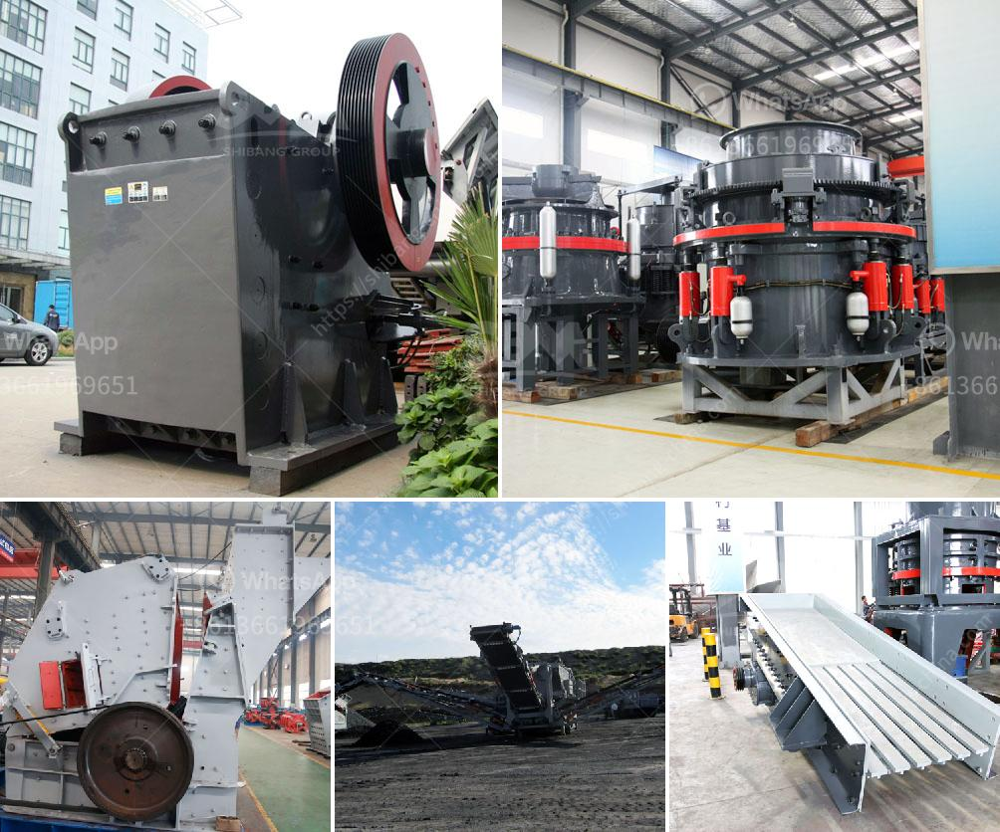

<h3>machine for crushing rock</h3>
A rock crusher, also commonly known as a stone crusher, is an essential machine for mining and quarrying. It is often used to crush rocks into smaller pieces for further processing. Rock crushers can be used in various industries, including mining, construction, metallurgy, and even chemical processing. With the development of modern technology, rock crushers have become more advanced and efficient, making crushing rocks easier and faster than ever before.

One of the key components in a rock crusher is a crusher mantle, which is used to crush rocks into smaller sizes. The mantle helps to maintain the shape of the rocks during the crushing process and ensures that the crushed fragments have a consistent size. This is especially important in industries where the final product needs to be uniform, such as in construction or road building.

There are several types of rock crushers available on the market, each with its unique features and capabilities. One popular choice is a jaw crusher, which can be used to crush both large and small rocks. Jaw crushers are typically designed with a fixed jaw plate and a movable jaw plate. The movable jaw plate exerts force on the rock by directly pressing it against the fixed jaw plate, thus crushing it into smaller pieces.

Another type of rock crusher is a cone crusher. This machine is often used in secondary or tertiary crushing processes because it can crush rocks of various sizes and shapes. Cone crushers have a conical-shaped bowl and a rotating mantle that rotates eccentrically, crushing the rocks between the mantle and bowl liner.

In addition to jaw and cone crushers, there are also impact crushers that utilize impact force to crush the rocks. These machines contain a high-speed rotor with blow bars or hammers that impact the rocks and break them apart. Unlike jaw and cone crushers, impact crushers produce cubic-shaped fragments, making them optimal for medium to fine crushing processes.

The efficiency and effectiveness of a rock crusher largely depend on several factors, including the feed size, the impact force, and the speed of the machine. Ideally, the feed size should be less than the machine's crushing capacity to ensure efficient operation. Additionally, the impact force and speed should be carefully adjusted to avoid overcrushing or undercrushing the rocks.

Rock crushers have significantly contributed to the advancement of various industries, making the crushing process more efficient and convenient. They have increased productivity and reduced labor requirements in mining and quarrying operations. Furthermore, rock crushers have improved overall safety in the workplace by minimizing the manual handling of large rocks.

In conclusion, rock crushers are essential machines in mining and quarrying operations. They crush rocks into smaller pieces, ensuring the uniformity and consistency of the final product. With the advancements in technology, rock crushers have become more efficient and versatile, enabling industries to process a wide range of materials. Whether it is a jaw crusher, cone crusher, or impact crusher, each machine plays a crucial role in the crushing process, making it easier and faster than ever before.
<h3>Contact us</h3><ul><li><strong>Whatsapp:&nbsp;<a href="https://wa.me/8613661969651">+8613661969651</a></strong></li><li><a href="https://swt.shibang-china.com/?git&amp;zhl&amp;machine for crushing rock"><strong>Online Service(chat now)</strong></a></li></ul><h3>Related</h3><ul><li><a href='making of calcium carbonate calcite powder.md'>making of calcium carbonate calcite powder</a></li><li><a href='hammer mill south africa.md'>hammer mill south africa</a></li><li><a href='fly ash processing plant.md'>fly ash processing plant</a></li><li><a href='stone crusher united states project.md'>stone crusher united states project</a></li><li><a href='gypsum manufacturing machine.md'>gypsum manufacturing machine</a></li></ul>