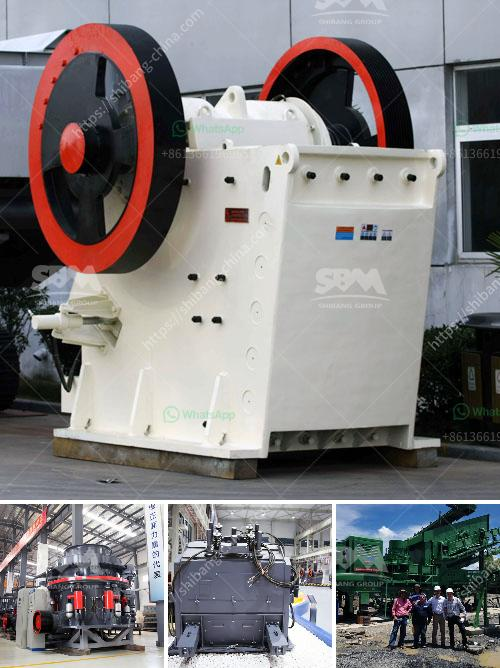

<h3>machine of conveyor belts</h3>
The invention of conveyor belts revolutionized industries by automating the transportation of goods. These machines have become an integral part of numerous sectors, including manufacturing, mining, agriculture, and logistics. They play a crucial role in increasing efficiency, reducing labor costs, and enhancing overall productivity. With a history spanning several decades, conveyor belts continue to evolve, incorporating advanced technologies and features to meet the changing demands of modern industries.

The concept of conveyor belts dates back to the late 18th century when primitive belts made of leather or canvas were used to move goods short distances. It was not until the early 20th century that the first automated conveyor system was developed, which consisted of a powered belt system moving items vertically or horizontally. Over time, the technology improved, leading to the creation of more sophisticated machines capable of handling heavier loads and longer distances.

The most common type of conveyor belt is the flat belt, consisting of a continuous loop of durable material. This loop sits on a series of rollers, allowing the belt to move smoothly and carry objects along its path. To ensure proper functioning, conveyor belts are driven by powerful motors that provide continuous rotation, propelling the materials from one point to another. Additionally, various control systems monitor speed, alignment, and load distribution to optimize performance and prevent malfunctions.

The versatility of conveyor belts lies in their ability to transport a wide range of products. From small and lightweight items to heavy machinery and bulk materials, conveyor belts can handle diverse payloads efficiently. Different belt materials, such as rubber, PVC, or metal, are chosen based on the specific requirements of the industry. For instance, heat-resistant belts are used in foundries and steel mills, while food-grade belts are employed in the food processing industry where hygiene is of utmost importance.

Conveyor belts are not limited to straight paths; they can be configured to follow curves and inclines to navigate through complex environments. This flexibility enables seamless integration into existing production lines, optimizing space utilization and adaptability. Moreover, modular designs allow for easy customization, allowing businesses to tailor conveyor systems according to their unique needs.

Apart from their primary function of material transportation, conveyor belts can also perform additional tasks. Some conveyor systems feature sorting mechanisms that automatically divert items to different destinations based on their size, weight, or other attributes. This multi-functionality increases efficiency, reducing the need for manual sorting or intervention.

As industries continue to evolve, the technology powering conveyor belts has also advanced. Today, cutting-edge systems incorporate sensors, robotics, and artificial intelligence to further enhance performance. Intelligent conveyor systems can detect and correct errors, monitor inventory levels, and relay real-time data to central control systems, enabling better decision-making and streamlined operations.

In conclusion, conveyor belts have revolutionized industries by simplifying and automating the transportation process. These machines have greatly improved efficiency, reducing labor costs and enhancing overall productivity. With their ability to handle a wide range of products and navigate various environments, conveyor belts have become an essential component of numerous sectors. As technology continues to progress, we can expect conveyor belts to become even more advanced, facilitating seamless and efficient material flow for the industries of the future.
<h3>Contact us</h3><ul><li><strong>Whatsapp:&nbsp;<a href="https://wa.me/8613661969651">+8613661969651</a></strong></li><li><a href="https://swt.shibang-china.com/?git&amp;zhl&amp;machine of conveyor belts"><strong>Online Service(chat now)</strong></a></li></ul><h3>Related</h3><ul><li><a href='blake jaw crusher.md'>blake jaw crusher</a></li><li><a href='sliding shoe bearing ball mill skf.md'>sliding shoe bearing ball mill skf</a></li><li><a href='small sacle crushers in zambia.md'>small sacle crushers in zambia</a></li><li><a href='stone crusher plant project report.md'>stone crusher plant project report</a></li><li><a href='cement clinker grinding unit.md'>cement clinker grinding unit</a></li></ul>