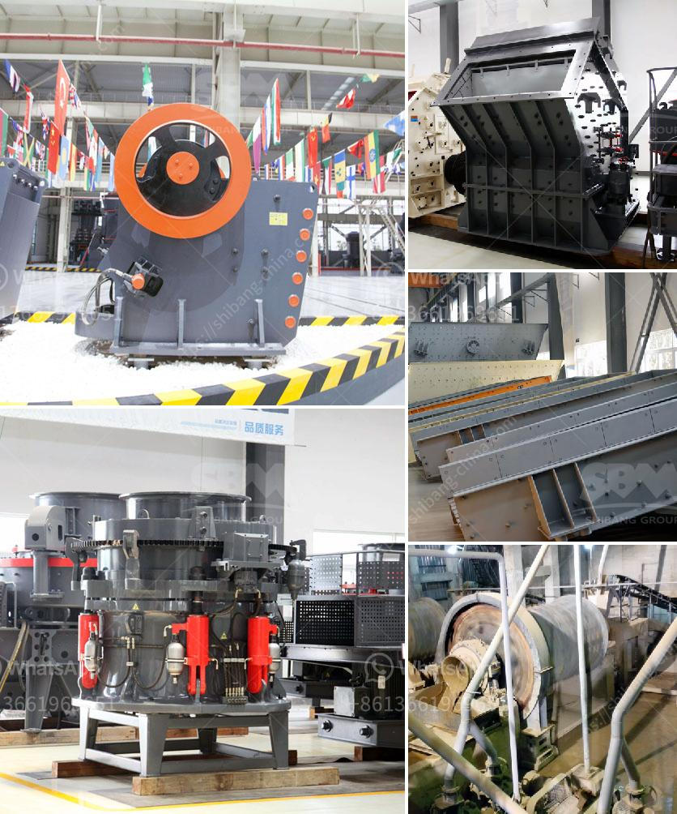

<h3>machine to make dolomite powder</h3>
In the world of mining and mineral processing, there are several essential stages that must be completed to extract valuable minerals from the earth. One of these crucial steps is pulverizing dolomite, a naturally occurring mineral, into a fine powder. Dolomite powder has various applications in diverse industries, including agriculture, ceramics, glass, and construction. To meet the growing demand for dolomite powder, manufacturers have introduced an innovative machine that streamlines the dolomite processing process, ensuring efficiency and quality. This article explores the significance of this machine and the impacts it has on the dolomite industry.

Traditionally, dolomite powder has been produced through manual methods, which involve crushing, grinding, and screening the dolomite rock manually. This process is not only labor-intensive but also time-consuming, demanding additional manpower and significant investment. Furthermore, the manual process is vulnerable to human error, leading to inconsistent dolomite powder qualities that do not meet industry standards. To tackle these challenges, mineral processing companies have developed a specialized machine for dolomite powder production.

The machine to make dolomite powder is an automated, state-of-the-art equipment designed specifically for powdered dolomite production. This machine eliminates the need for manual intervention and reduces human error, guaranteeing consistent and high-quality dolomite powder output. The automated machine efficiently crushes and grinds dolomite rocks into a fine powder, adhering to precise particle size requirements. This, in turn, enhances product quality, making it suitable for diverse applications.

One of the key advantages of using the machine to make dolomite powder is its efficiency. The automated process significantly reduces the time required for dolomite processing. With the machine's high-speed capabilities, large quantities of dolomite rocks can be processed quickly, increasing overall production rates. This not only meets the escalating demand for dolomite powder but also allows manufacturers to meet deadlines and deliver products promptly.

Aside from improving efficiency and productivity, the machine to make dolomite powder also enhances workplace safety. Manual dolomite processing can be hazardous due to the use of heavy machinery, dust exposure, and physical strain on workers. By employing an automated machine, employees can minimize their exposure to risks and focus on other value-added tasks within the production process. This fosters a safer working environment and reduces the likelihood of accidents or injuries.

Furthermore, the adoption of the machine to make dolomite powder contributes to environmental sustainability. Traditional dolomite powder production processes generate dust and waste, which can have adverse effects on the environment if not properly managed. With the automated machine, the process is contained within a closed system, preventing the release of dust particles and minimizing waste generation. By reducing environmental impact, dolomite manufacturers can align their operations with sustainable practices and regulations.

In conclusion, the introduction of a machine to make dolomite powder has revolutionized the dolomite processing industry. This automated technology streamlines production, ensuring consistent and high-quality dolomite powder output. With improved efficiency, workplace safety, and environmental sustainability, this innovative machine has become an integral part of the dolomite industry. By embracing automation and investing in advanced machinery, mineral processing companies can stay competitive, meet customer demands, and contribute to a greener future.
<h3>Contact us</h3><ul><li><strong>Whatsapp:&nbsp;<a href="https://wa.me/8613661969651">+8613661969651</a></strong></li><li><a href="https://swt.shibang-china.com/?git&amp;zhl&amp;machine to make dolomite powder"><strong>Online Service(chat now)</strong></a></li></ul><h3>Related</h3><ul><li><a href='mobile crushers qatar.md'>mobile crushers qatar</a></li><li><a href='washing powder production line.md'>washing powder production line</a></li><li><a href='rotary screen for coal making process.md'>rotary screen for coal making process</a></li><li><a href='enquiry impact crusher.md'>enquiry impact crusher</a></li><li><a href='double rotor hammer crusher.md'>double rotor hammer crusher</a></li></ul>