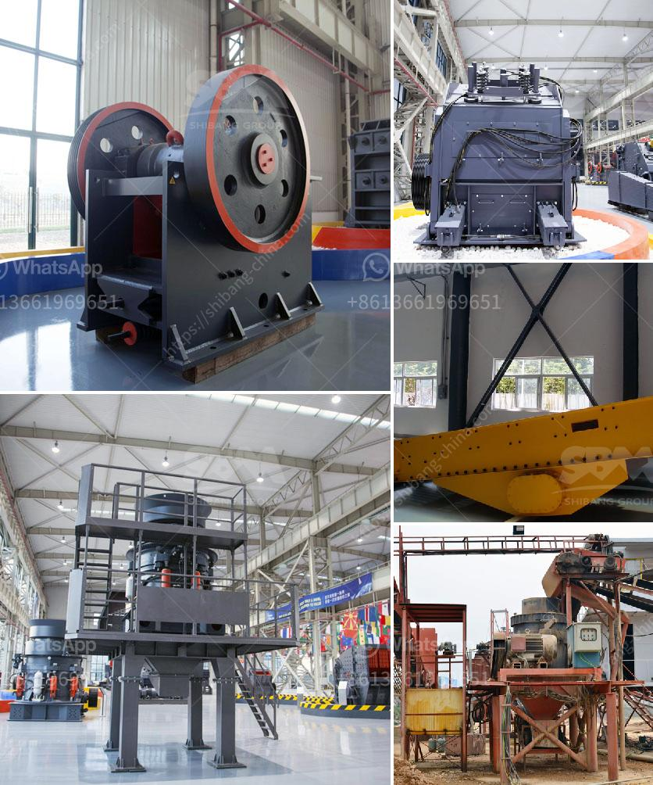

<h3>machinery required for marble quarry crusher</h3>
Quarrying operations typically involve drilling, blasting, and cutting processes to extract marble from the ground. These methods require specialized machinery to ensure a smooth and efficient operation. One essential piece of equipment in a marble quarry crusher is the jaw crusher, which is used for crushing large blocks of marble into smaller pieces.

The jaw crusher has a reciprocating motion, meaning that it continually moves back and forth to crush marble against the fixed jaw plate. This compression-type crusher is highly effective in producing uniform-sized particles, thus ensuring higher processing efficiency. Additionally, it can handle various types of marble, regardless of their hardness.

Another essential machine in the marble quarry crusher plant is the impact crusher, commonly used for secondary crushing. It has a larger impact force, making it suitable for crushing medium-hard materials. The impact crusher operates by striking the marble with a high-speed rotor, which causes it to break into smaller pieces.

In some cases, a cone crusher may also be used for primary crushing. This type of crusher is particularly effective for processing larger quantities of marble. The cone crusher works by squeezing the marble between an eccentrically gyrating spindle and a concave hopper, ensuring the marble is thoroughly crushed into the desired size.

To ensure the smooth operation of these machineries, regular maintenance is crucial. It involves inspecting the wear parts such as the jaw plates, impact bars, and cone mantles for any signs of damage or wear. Routine lubrication and monitoring of oil levels are also vital for optimal performance.

In conclusion, the machinery required for a marble quarry crusher includes the jaw crusher, impact crusher, and sometimes the cone crusher. These machines ensure a smooth and efficient operation, enabling the extraction of marble in various sizes and grades. With regular maintenance, these machines can provide years of reliable service, contributing to the profitability of quarry operations.
<h3>Contact us</h3><ul><li><strong>Whatsapp:&nbsp;<a href="https://wa.me/8613661969651">+8613661969651</a></strong></li><li><a href="https://swt.shibang-china.com/?git&amp;zhl&amp;machinery required for marble quarry crusher"><strong>Online Service(chat now)</strong></a></li></ul><h3>Related</h3><ul><li><a href='used mobile crushers for sale south africa.md'>used mobile crushers for sale south africa</a></li><li><a href='chrome ore concentrate plant.md'>chrome ore concentrate plant</a></li><li><a href='small rock crusher for small scale aggregate producers.md'>small rock crusher for small scale aggregate producers</a></li><li><a href='stone crusher plant price list.md'>stone crusher plant price list</a></li><li><a href='price jaw crusher pdf.md'>price jaw crusher pdf</a></li></ul>