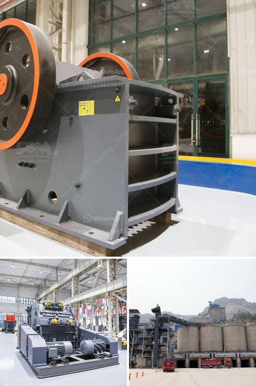

<h3>machines use for mining sand from river</h3>
With the growing demand for construction materials, sand has become an invaluable resource. Rivers have long been a source of sand, which is used for everything from concrete to glass production. However, the traditional manual extraction of sand from rivers is not only labor-intensive but also harmful to the environment. As a solution to this problem, machines are being used to effectively and sustainably mine sand from rivers.

These machines, known as dredgers, are specially designed to extract sand from riverbeds. They consist of a large floating platform equipped with powerful pumps, hoses, and suction mechanisms. The dredger is positioned over the targeted area, and the pumps create a vacuum, sucking up sand from the riverbed and transferring it through the hoses to the platform. The excess water is then drained, leaving behind the valuable sand.

Using machines for sand mining offers several advantages. Firstly, it significantly reduces the need for manual labor, increasing efficiency and productivity. This has a positive impact on the livelihoods of workers who would otherwise be involved in labor-intensive extraction processes. Secondly, machine mining ensures a more consistent and reliable supply of sand, as the process can be conducted year-round, regardless of weather conditions or water levels in the river.

Moreover, machine extraction minimizes the environmental impact compared to traditional methods. Dredgers are designed to extract sand without disturbing the riverbed or its surrounding ecosystem. This reduces the disturbance to aquatic life and the risk of erosion or flooding caused by altering the natural flow of rivers. Properly managed and regulated, machine mining offers a more sustainable approach to meet the growing demand for sand.

However, it is crucial to ensure responsible mining practices to mitigate potential negative impacts. Proper management must include regular monitoring of rivers, implementing extraction limits, and restoring disturbed riverbeds. Additionally, engaging local communities and indigenous populations in decision-making processes can help address concerns and ensure equitable distribution of benefits.

In conclusion, machines have revolutionized the extraction of sand from rivers by providing a more efficient and sustainable approach. With proper management and responsible mining practices, machine mining can help meet the increasing demand for sand while minimizing environmental degradation.
<h3>Contact us</h3><ul><li><strong>Whatsapp:&nbsp;<a href="https://wa.me/8613661969651">+8613661969651</a></strong></li><li><a href="https://swt.shibang-china.com/?git&amp;zhl&amp;machines use for mining sand from river"><strong>Online Service(chat now)</strong></a></li></ul><h3>Related</h3><ul><li><a href='raymond mill from china best supplier on sale.md'>raymond mill from china best supplier on sale</a></li><li><a href='100tpd mini cement plant project cost in india.md'>100tpd mini cement plant project cost in india</a></li><li><a href='rock crusher machine agent in malaysia.md'>rock crusher machine agent in malaysia</a></li><li><a href='hammer mill crusher type.md'>hammer mill crusher type</a></li><li><a href='industrial vibrator feeders.md'>industrial vibrator feeders</a></li></ul>