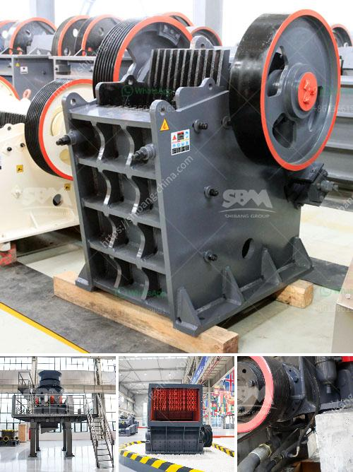

<h3>machines used for coal mining</h3>
Mining is a centuries-old industry that has provided countless societies with an essential resource – coal. Coal is used as a primary source of heat and energy in various industries across the globe, making it a critical component in powering economies and fulfilling everyday needs. Mining for coal, however, is not an easy task and requires heavy machinery to extract this valuable resource from the earth. In this article, we will explore the machines used in coal mining and the importance of their roles.

One of the most crucial machines used in coal mining is the Coal Cutter. A coal cutter is a machine that is used in underground coal mining operations to mechanically extract the coal from the earth. These machines are typically operated by trained professionals known as coal miners and work in conjunction with a system of conveyor belts and other equipment to extract the coal. The coal cutter utilizes a rotating drum with sharp cutting teeth or picks, which penetrate the coal seam and remove the coal, allowing for the continuous mining of the resource.

Another machine used in coal mining is the Continuous Miner. Continuous miners are machines designed to remove the coal from the face and load it onto conveyors or into shuttle cars in underground mining operations. These machines can weigh up to 75 tons and are capable of cutting and loading large volumes of coal in a single pass. Continuous miners often operate in groups, with other machines working together to extract the coal efficiently. Their cutting and loading capabilities make them indispensable in underground coal mining.

In open-pit coal mining, a Dragline Excavator is used. Draglines are enormous machines that excavate the earth and expose the coal seams for mining. These machines are the largest land-based machines worldwide and are typically used in large-scale mining operations. Draglines consist of a large bucket, also known as a drag bucket, suspended from a boom. The drag bucket is lowered to the ground and filled with dirt and rocks, which are then lifted and dumped into a transportation vehicle. Draglines reduce the need for manual labor and enable the extraction of vast quantities of coal.

Dump Trucks also play an integral role in coal mining. These massive trucks are designed to transport large volumes of extracted coal from the mining site to the processing or storage areas. Dump trucks are highly durable and equipped with powerful engines that allow them to travel over challenging terrains. They come in various sizes and can carry loads ranging from a few dozen tons to several hundred tons. Dump trucks significantly enhance the efficiency of coal mining operations by quickly transporting the extracted coal to its next destination.

In recent years, advancements in technology have also introduced Automated Mining Equipment, which is transforming the coal mining industry. These highly advanced machines are capable of operating autonomously, reducing the need for human intervention and increasing productivity. Automated mining equipment uses sensors and GPS technology to navigate and perform various tasks, such as drilling, blasting, and hauling, with precision and efficiency. These machines are revolutionizing the coal mining process by making it safer, faster, and more cost-effective.

In conclusion, coal mining is a demanding industry that relies heavily on the use of specialized machines. Coal cutters, continuous miners, draglines, dump trucks, and automated mining equipment all have vital roles in making coal mining possible and efficient. These machines not only extract coal but also ensure the safety and well-being of the coal miners. As technology continues to advance, the coal mining industry will undoubtedly witness further advancements in the machines used for this essential and impactful process.
<h3>Contact us</h3><ul><li><strong>Whatsapp:&nbsp;<a href="https://wa.me/8613661969651">+8613661969651</a></strong></li><li><a href="https://swt.shibang-china.com/?git&amp;zhl&amp;machines used for coal mining"><strong>Online Service(chat now)</strong></a></li></ul><h3>Related</h3><ul><li><a href='how to make ball mill pdf.md'>how to make ball mill pdf</a></li><li><a href='cement crusher machines price in india.md'>cement crusher machines price in india</a></li><li><a href='ballast quarry crusher machines.md'>ballast quarry crusher machines</a></li><li><a href='second hand sand mill in holland.md'>second hand sand mill in holland</a></li><li><a href='suppliers of chrome ore beneficiation plant.md'>suppliers of chrome ore beneficiation plant</a></li></ul>