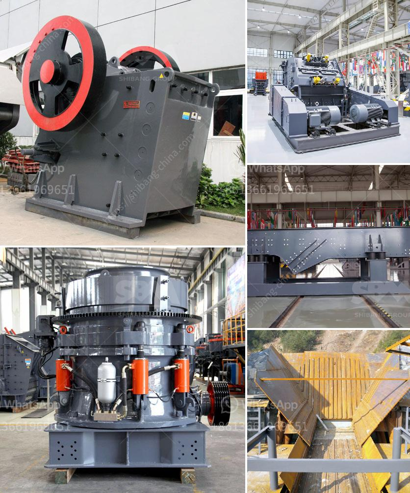

<h3>magnesite ore mining process</h3>
Magnesite is a mineral rich in magnesium oxide, used as a raw material in various industries such as cement production, chemicals, and steel manufacturing. Magnesite ore can be found in both open pit and underground mining operations.

Before the raw magnesite ore can be used for industrial purposes, it must go through a beneficiation process to remove impurities and improve the quality. This process typically involves crushing the ore into smaller fragments and then grinding it into a fine powder. Afterward, various techniques like magnetic separation, flotation, and gravity separation are employed to remove unwanted minerals and obtain a concentrated form of magnesite.

The next step in the mining process is the calcination of magnesite ore at high temperatures. This process involves heating the ore in rotary kilns to drive off carbon dioxide, leaving behind magnesium oxide (MgO). Calcination is an important step as it transforms magnesite into a more suitable form for downstream applications.

Once the magnesite is calcined, it can be further processed into different products. For example, if the desired end product is caustic magnesium oxide, the calcined magnesite is treated with water to produce a slurry, which is then dried and crushed into a fine powder.

In conclusion, magnesite ore mining is a multi-step process involving various techniques to remove impurities and concentrate the desired magnesium oxide. From crushing and grinding to calcination and further processing, each step is vital to ensure the production of high-quality magnesite for use in different industries. With the growing demand for magnesium-based products, efficient and sustainable mining processes are crucial to meet the global needs while minimizing environmental impacts.
<h3>Contact us</h3><ul><li><strong>Whatsapp:&nbsp;<a href="https://wa.me/8613661969651">+8613661969651</a></strong></li><li><a href="https://swt.shibang-china.com/?git&amp;zhl&amp;magnesite ore mining process"><strong>Online Service(chat now)</strong></a></li></ul><h3>Related</h3><ul><li><a href='calcium carbonate mines in pakistan.md'>calcium carbonate mines in pakistan</a></li><li><a href='russia equipment manufacturers mining.md'>russia equipment manufacturers mining</a></li><li><a href='quartz stone manufacturing plant.md'>quartz stone manufacturing plant</a></li><li><a href='process of cement production.md'>process of cement production</a></li><li><a href='stone crushing machines in canada.md'>stone crushing machines in canada</a></li></ul>