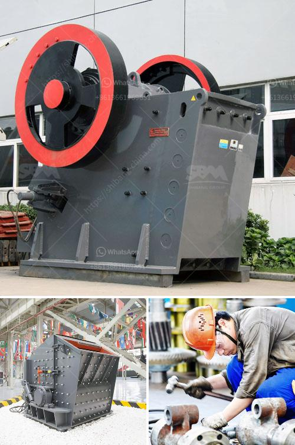

<h3>magnetic separator distributor in surabaya</h3>
A magnetic separator distributor is a company that sells and distributes magnetic separators in Surabaya. Magnetic separators are used to separate magnetic materials from non-magnetic ones. They are essential equipment in many industries such as mining, recycling, ceramics, food processing, and pharmaceuticals.

Surabaya, being one of the industrial hubs of Indonesia, has a growing demand for magnetic separators. As a result, several distributors have emerged in the city to cater to this demand. These distributors source their products from reputable manufacturers and provide a wide range of options to meet the diverse needs of their customers.

One of the benefits of having a magnetic separator distributor in Surabaya is the availability of local support and expertise. These distributors understand the local market and can provide valuable insights and recommendations to their customers. They can also provide after-sales services such as installation, maintenance, and repair, ensuring the efficient operation of the magnetic separators.

Another advantage of purchasing from a local distributor is the reduced lead time and shipping costs. Instead of waiting for products to be imported from other countries, customers can receive their orders quickly and at a lower cost. This not only saves time but also helps in reducing the overall expenses of the industries.

Moreover, magnetic separator distributors in Surabaya often have a comprehensive inventory of products in stock. This ensures that customers can find the specific type and size of magnetic separator they need without any delay. Additionally, these distributors may also offer customization options to meet specific requirements or provide tailor-made solutions for unique applications.

In conclusion, the presence of a magnetic separator distributor in Surabaya is beneficial for both industries and businesses. It ensures easy access to high-quality separators, local support, reduced lead time, and customization options. As Surabaya continues to grow as an industrial city, the demand for magnetic separators will also increase, making the distributors even more invaluable.
<h3>Contact us</h3><ul><li><strong>Whatsapp:&nbsp;<a href="https://wa.me/8613661969651">+8613661969651</a></strong></li><li><a href="https://swt.shibang-china.com/?git&amp;zhl&amp;magnetic separator distributor in surabaya"><strong>Online Service(chat now)</strong></a></li></ul><h3>Related</h3><ul><li><a href='concrete crushers for rent.md'>concrete crushers for rent</a></li><li><a href='malaysia grinder hammer mill manufacturer.md'>malaysia grinder hammer mill manufacturer</a></li><li><a href='bentonite crusher grinding mill mobile.md'>bentonite crusher grinding mill mobile</a></li><li><a href='stone crushing plant project report doc.md'>stone crushing plant project report doc</a></li><li><a href='coal mining equipment for sale.md'>coal mining equipment for sale</a></li></ul>