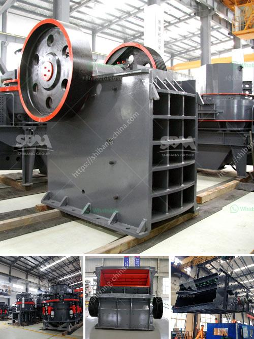

<h3>major advantage of impact cone crusher</h3>
The cone crusher is a type of heavy-duty machinery suitable for crushing a variety types of raw materials, including ores and medium-hard rocks. Compared with a jaw or rock crusher, the cone crusher is easier to adjust and has less owning and operating costs. Using compression methods, the cone crusher crushes the raw material between the fixed and moving cones. Additionally, the cone crusher is applied in many demanding environments to crush hard and abrasive materials.

One of the key advantages of the cone crusher is its ability to limit the amount of waste material produced during operation. The compression ratio of this machine is typically higher than jaw crushers. Furthermore, the cone crusher produces less noise and dust compared to other types of crushers, reducing the risk of dust-related health issues.

The use of high-quality materials ensures that the cone crusher performs consistently over time. Due to its sturdy construction and compact design, it is also highly resistant to impact and wear. This results in lower maintenance and repair costs, making the cone crusher a valuable investment.

Another advantage of the cone crusher is its ability to perform well in a variety of different crushing applications. This versatility allows for added flexibility in the design of machinery, conveyor systems, and control cabinets. Thanks to its high-performance crushing ability, the cone crusher is often utilized in larger production circuits that require reliable and efficient size reduction.

The cone crusher also offers flexibility within the crushing circuit thanks to its smaller physical dimensions. Due to its smaller footprint, the cone crusher can be easily integrated into existing crushing plants. This simplifies installation, maintenance, and reduces overall costs.

In addition to these operational advantages, the cone crusher also provides a safer way to handle large objects compared to other crushers. With its design, the user does not have to worry about the risk of objects getting stuck in the machine or being ejected during the crushing process. This allows for a more secure and efficient operation.

Furthermore, the cone crusher’s ability to withstand high temperatures and abrasive materials makes it more reliable in extreme conditions. This makes it an ideal choice for mining, construction, and aggregate industries that work in harsh environments.

To summarize, the major advantages of the cone crusher are its reliability, low operating costs, and high versatility. The cone crusher offers a consistent performance that consistently meets the required production goals. It is an ideal choice for customers looking for high-quality end products with excellent shape and size reduction properties. Additionally, the cone crusher’s compact design, low maintenance requirements, and ability to handle abrasive materials make it a valuable investment for various industries.
<h3>Contact us</h3><ul><li><strong>Whatsapp:&nbsp;<a href="https://wa.me/8613661969651">+8613661969651</a></strong></li><li><a href="https://swt.shibang-china.com/?git&amp;zhl&amp;major advantage of impact cone crusher"><strong>Online Service(chat now)</strong></a></li></ul><h3>Related</h3><ul><li><a href='packing plant in cement industry.md'>packing plant in cement industry</a></li><li><a href='how to make ball mill pdf.md'>how to make ball mill pdf</a></li><li><a href='carbon black grinder pulvilizer fine powder india.md'>carbon black grinder pulvilizer fine powder india</a></li><li><a href='operation crushing plant.md'>operation crushing plant</a></li><li><a href='raymond mill in chennai.md'>raymond mill in chennai</a></li></ul>