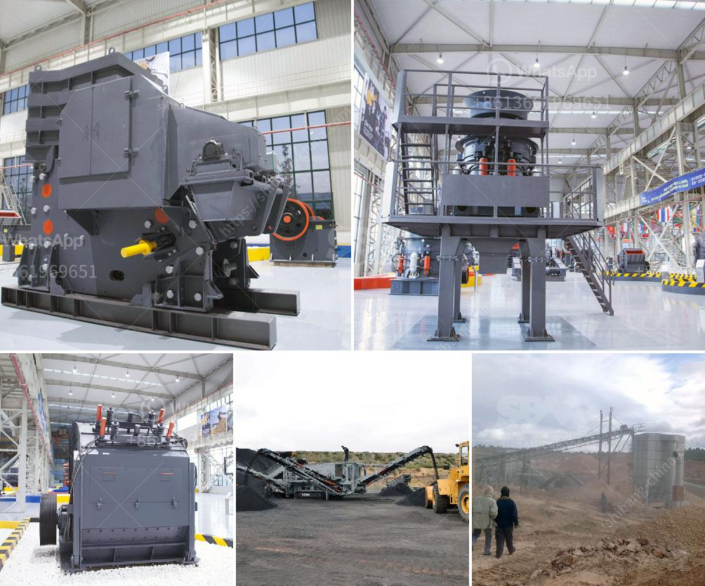

<h3>making of calcium carbonate calcite powder</h3>
Calcium carbonate, also known as calcite powder, is a versatile mineral with various applications. It is a common substance found in rocks and is the main component of shells of marine organisms, snails, pearls, and eggshells. In its powder form, calcium carbonate has become an essential ingredient in industries such as food, pharmaceuticals, construction, cosmetics, and agriculture.

The process of making calcium carbonate powder involves several steps. Let's delve into the details of this fascinating process.

The first step is to extract calcium carbonate from the natural deposits in quarries. Depending on the location and quality of the rock, various methods can be employed, such as open-pit mining, underground mining, or dredging. These methods involve drilling, blasting, and extracting the raw materials from the earth.

Once the calcium carbonate rock is extracted, it is crushed and ground into smaller particles. Initially, large chunks are crushed into smaller pieces using heavy machinery like jaw crushers and cone crushers. The crushed rock is then further processed through grinding mills, such as ball mills or vertical roller mills, which reduce the particle size to a fine powder.

After grinding, the calcium carbonate powder undergoes a classification process to separate it according to particle size. The powder is passed through classifiers or sieves that separate the desired particle size from the oversize particles. This ensures the final product's uniformity and consistency, meeting the specific requirements of different industries.

For certain applications where a finer particle size is required, the calcium carbonate powder goes through a micronization process. This process involves further grinding using specialized equipment, such as jet mills or impact mills, to achieve micron-sized particles. Micronized calcium carbonate provides improved dispersion, increased surface area, and enhanced properties for specific applications like coatings and paints.

Depending on the end-use, calcium carbonate powder may undergo purification and surface treatment processes. Purification involves removing impurities present in the powder, ensuring high purity levels. Surface treatment may involve coating the particles with chemicals or additives to enhance properties like moisture resistance, dispersibility, and compatibility with other substances.

Once the calcium carbonate powder is manufactured, it is packaged and prepared for distribution. The powder is typically packaged in bags, drums, or bulk containers depending on the quantity and requirements of the customers. Quality control measures are implemented to maintain product integrity throughout the packaging and distribution process.

In conclusion, the manufacturing process of calcium carbonate calcite powder involves extracting and quarrying the raw material, crushing, grinding, classification, micronization, purification, surface treatment, and packaging. Each step is carefully controlled to ensure the production of high-quality calcium carbonate powder that meets the diverse needs of industries worldwide. As an essential mineral with numerous applications, calcium carbonate calcite powder continues to play a vital role in various industries, contributing to technological advancements and improving the quality of everyday products.
<h3>Contact us</h3><ul><li><strong>Whatsapp:&nbsp;<a href="https://wa.me/8613661969651">+8613661969651</a></strong></li><li><a href="https://swt.shibang-china.com/?git&amp;zhl&amp;making of calcium carbonate calcite powder"><strong>Online Service(chat now)</strong></a></li></ul><h3>Related</h3><ul><li><a href='process flow gold copper mining.md'>process flow gold copper mining</a></li><li><a href='jaw crusher maharashtra.md'>jaw crusher maharashtra</a></li><li><a href='diy stone crushing machine.md'>diy stone crushing machine</a></li><li><a href='coal mill 250 ton.md'>coal mill 250 ton</a></li><li><a href='used conveyor belt in kenya.md'>used conveyor belt in kenya</a></li></ul>