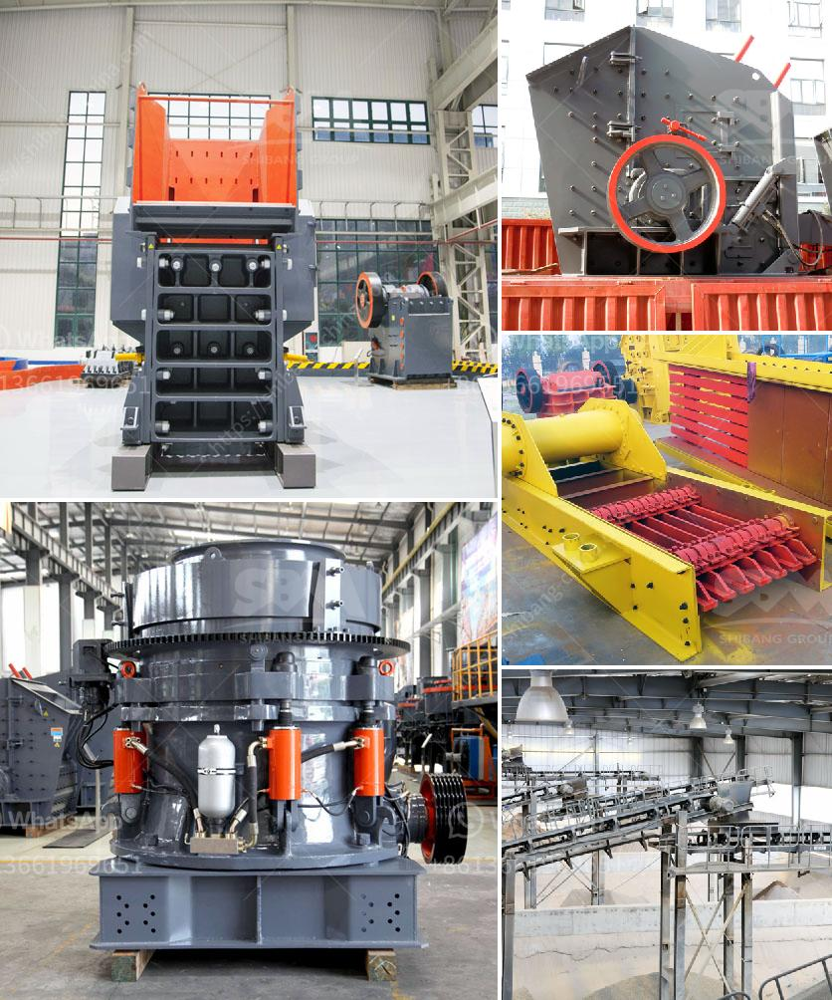

<h3>malaysia grinder hammer mill manufacturer</h3>
Malaysia is one of the leading countries when it comes to the production and manufacturing of grinders, hammer mills, and other related equipment. With decades of experience in designing and manufacturing these machines, Malaysia has emerged as a major player in the industry.

One of the top manufacturers in Malaysia is ABC Machinery. With a strong commitment to quality and innovation, ABC Machinery has earned a reputation for producing high-quality grinders and hammer mills that are not only efficient but also reliable.

The grinder hammer mill is a key piece of equipment in the grinding and milling processes. It is used to grind various materials such as grains, wood chips, biomass, and many others into smaller particles or powder. This process is essential in the production of many products, including animal feed, biofuel, and others.

The grinder hammer mill manufactured in Malaysia is designed to crush and grind different materials. It is made of high-quality materials and comes with advanced features to ensure optimal performance. The machine is equipped with a powerful motor that provides high-speed rotation, allowing for efficient and quick grinding of the materials.

One of the key advantages of the grinder hammer mill from Malaysia is its versatility. It can be used to grind a wide range of materials, including corn, soybeans, wheat, and even small tree branches. This makes it a valuable machine for various industries, such as agriculture, biomass, and feed mills.

In addition to its versatility, the grinder hammer mill from Malaysia is also known for its durability and low maintenance. The machine is built to withstand the toughest conditions and continue to deliver consistent performance for years. This also translates to cost-effectiveness for the operators, as they can rely on the machine for a long time without the need for frequent repairs or replacements.

Another important aspect of the grinder hammer mill from Malaysia is its efficiency. The machine is designed to maximize productivity and minimize energy consumption. It is equipped with advanced mechanisms for grinding and crushing materials efficiently, resulting in higher output while using less power.

Furthermore, Malaysia's grinder hammer mill manufacturers prioritize safety in their designs. The machine is built with safety features to protect the operator and prevent accidents. These safety features include safety guards, emergency stop buttons, and automatic shut-off mechanisms.

In conclusion, Malaysia is a leading manufacturer of grinder hammer mills, providing efficient, reliable, and durable machines for various industries. With a commitment to quality and innovation, Malaysian manufacturers like ABC Machinery continue to push the boundaries of technology, ensuring that their machines meet the changing needs of the market. Whether for agricultural purposes, biomass production, or feed milling, the grinder hammer mill from Malaysia is an excellent choice for reliable and efficient grinding operations.
<h3>Contact us</h3><ul><li><strong>Whatsapp:&nbsp;<a href="https://wa.me/8613661969651">+8613661969651</a></strong></li><li><a href="https://swt.shibang-china.com/?git&amp;zhl&amp;malaysia grinder hammer mill manufacturer"><strong>Online Service(chat now)</strong></a></li></ul><h3>Related</h3><ul><li><a href='limestone feeding equipment cost.md'>limestone feeding equipment cost</a></li><li><a href='india grinding machine for talcum powder.md'>india grinding machine for talcum powder</a></li><li><a href='quarry equipment manufacturer.md'>quarry equipment manufacturer</a></li><li><a href='graphite mining india.md'>graphite mining india</a></li><li><a href='ball mill suppliers usa.md'>ball mill suppliers usa</a></li></ul>