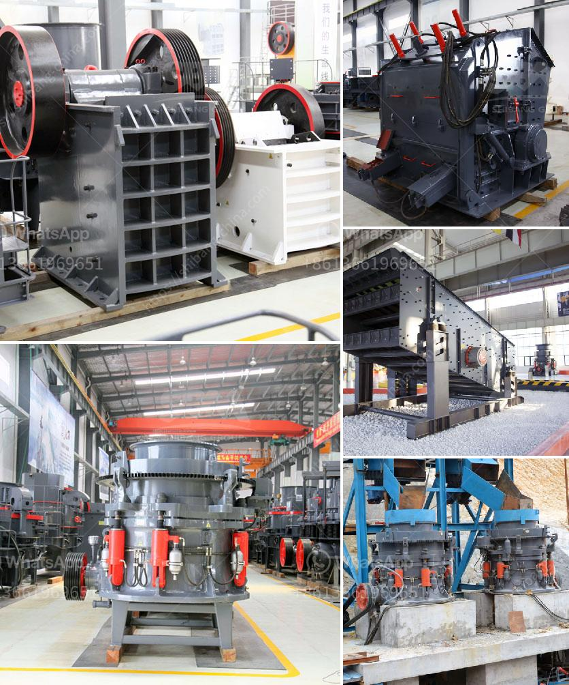

<h3>manganese crusher production line</h3>
Manganese is an essential element in steel production, making it a crucial metal in the mining industry. With the increasing demand for steel across the globe, the mining of manganese has seen a steady rise. Manganese crushers play an important role in the production of manganese ore. They have various applications in mining operations, including sorting, milling, and crushing. In this article, we will explore the importance of manganese crusher production line in the mining industry.

Manganese crusher production line consists of jaw crusher, impact crusher, vibrating screen, feeder, and belt conveyor. The materials are evenly sent to the jaw crusher for primary crushing. After the coarse crushing process, the materials are sent to the impact crusher for secondary crushing. The vibrating screen separates the crushed materials according to their sizes, and the qualified materials are sent to the finished product area through the belt conveyor.

One of the primary benefits of using a manganese crusher production line is its ability to increase productivity and efficiency in mining operations. With the high demand for steel, mining companies need to produce large quantities of manganese ore to meet market needs. The production line enables mining companies to process large volumes of manganese ore efficiently, reducing operation costs and maximizing output.

Additionally, the manganese crusher production line plays a significant role in reducing environmental impact. Traditional mining processes often involve extensive blasting, excavation, and transportation of raw materials. However, the production line allows for selective mining, reducing the need for large-scale excavation. This results in less disturbance to the environment and reduced carbon emissions associated with transportation.

Moreover, the use of advanced technology in manganese crusher production line enhances safety in mining operations. Automated systems and control mechanisms reduce the risks of accidents and ensure a safe working environment for miners. The integration of intelligent sensors and monitoring devices detects anomalies and malfunctions, allowing for timely interventions and preventions.

Furthermore, the manganese crusher production line contributes to the economic development of the local communities. Mining operations generate employment opportunities and stimulate the growth of supporting industries. The production line requires skilled labor for operation and maintenance, which creates job opportunities for the local workforce. Additionally, the demand for auxiliary services such as transportation, logistics, and equipment maintenance provides economic benefits to the surrounding communities.

In conclusion, the manganese crusher production line has become an indispensable component in the mining industry. Its efficiency, productivity, and environmental benefits make it a valuable asset for mining companies worldwide. By optimizing the extraction and processing of manganese ore, the production line enhances the sustainability of mining operations. Furthermore, it promotes economic growth and offers employment opportunities to local communities. As the demand for steel continues to rise, the importance of manganese crusher production line will only increase, bolstering the mining industry and its contribution to global development.
<h3>Contact us</h3><ul><li><strong>Whatsapp:&nbsp;<a href="https://wa.me/8613661969651">+8613661969651</a></strong></li><li><a href="https://swt.shibang-china.com/?git&amp;zhl&amp;manganese crusher production line"><strong>Online Service(chat now)</strong></a></li></ul><h3>Related</h3><ul><li><a href='basalt crushing machine.md'>basalt crushing machine</a></li><li><a href='dealing in portable crusher machine.md'>dealing in portable crusher machine</a></li><li><a href='small mobile gold grinding mill in philippines.md'>small mobile gold grinding mill in philippines</a></li><li><a href='mobile stone crusher for sale in philippines.md'>mobile stone crusher for sale in philippines</a></li><li><a href='machine crusher prices in nigeria.md'>machine crusher prices in nigeria</a></li></ul>