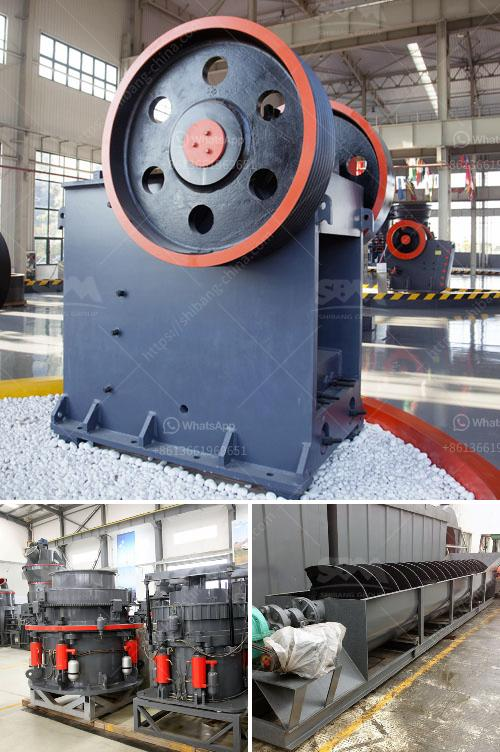

<h3>manufacture of hammer mill</h3>
The manufacture of a hammer mill is a complex, high-tech, and multistage process that involves many different steps. Whether you are starting a small scale pellet production facility or looking to upgrade an existing one, the hammer mill is definitely an essential piece of equipment. It is used to grind and crush a wide range of materials, from agricultural residues to wood chips and even metal scraps.

The first step in the manufacture of a hammer mill is the design phase. Engineers work closely with the client to understand their specific requirements and design a machine that meets their needs. Factors such as capacity, particle size, and power consumption are taken into consideration during this stage. Once the design is finalized, it is then sent to the manufacturing facility.

The second step in the manufacture is the fabrication of the main body of the hammer mill. Different materials, such as carbon steel or stainless steel, are used depending on the application and client's preference. Metal sheets are cut, bent, and welded together to create a sturdy and robust structure that can withstand the forces involved in grinding materials.

After the main body is fabricated, it is then coated with protective paint or powder coating to ensure that it is resistant to corrosion and can withstand heavy usage. Safety features, such as emergency stop buttons, are also added during this stage to ensure operator safety.

The third step is the assembly of the various components of the hammer mill. This includes adding the grinding chamber, hammers, screens, and other accessories. Each component is carefully installed and aligned to ensure optimal performance.

Once the hammer mill is fully assembled, it undergoes rigorous testing and quality control procedures. This includes testing the grinding capacity, power consumption, durability, and overall performance of the machine. Any issues or improvements are addressed and rectified during this stage.

Finally, the hammer mill is packaged and prepared for shipping to the client's location. It is important to ensure that the machine is properly secured and protected during transportation to avoid any damage.

In conclusion, the manufacture of a hammer mill involves a series of intricate steps that require attention to detail and expertise. From design to fabrication, assembly, testing, and shipping, each stage is crucial in ensuring the production of a high-quality and efficient machine. Whether for agricultural, industrial, or recycling purposes, a well-manufactured hammer mill can greatly enhance your production process.
<h3>Contact us</h3><ul><li><strong>Whatsapp:&nbsp;<a href="https://wa.me/8613661969651">+8613661969651</a></strong></li><li><a href="https://swt.shibang-china.com/?git&amp;zhl&amp;manufacture of hammer mill"><strong>Online Service(chat now)</strong></a></li></ul><h3>Related</h3><ul><li><a href='clinker grinding plant.md'>clinker grinding plant</a></li><li><a href='gold ore crushers for sale in india.md'>gold ore crushers for sale in india</a></li><li><a href='sand dryer machine italy.md'>sand dryer machine italy</a></li><li><a href='used limestone crushing equipment houston.md'>used limestone crushing equipment houston</a></li><li><a href='best stone crushers india.md'>best stone crushers india</a></li></ul>