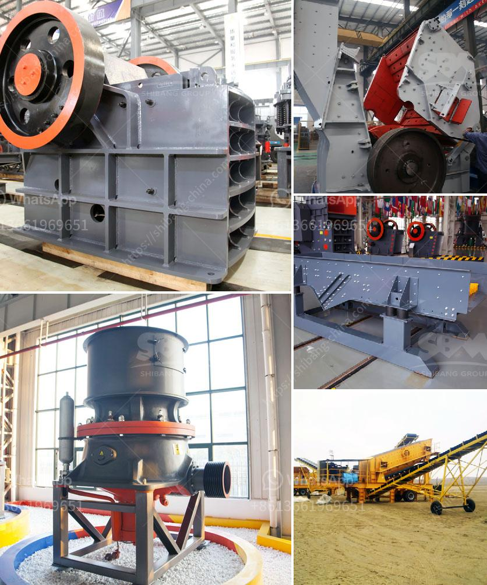

<h3>manufacturer of quartz powder in india</h3>
India is known for its rich and diverse natural resources, and one such resource is quartz. Quartz is a mineral that is abundantly found in the Indian subcontinent and is widely used in various industries due to its unique properties. It is a hard and durable mineral with high heat resistance, making it perfect for use in manufacturing processes. In India, there are several manufacturers of quartz powder who cater to the growing demand for this versatile mineral.

One such prominent manufacturer of quartz powder in India is ABC Industries. With years of experience in the industry, ABC Industries has established itself as a leading player in the market. The company is known for its high-quality products, strict quality control measures, and customer-centric approach. They have a state-of-the-art manufacturing facility equipped with advanced machinery and technology to ensure consistent and reliable production.

At ABC Industries, the process of manufacturing quartz powder starts with the sourcing of raw materials. The company carefully selects the best quality quartz rocks, which are then crushed and ground into a fine powder. The manufacturing process involves several stages, including washing, drying, grinding, and sieving, to obtain the desired particle size. ABC Industries also ensures that the final product is free from impurities and contaminants through rigorous quality checks.

The quartz powder manufactured by ABC Industries finds applications in various industries such as ceramics, glass, electrical insulation, paints, and coatings, among others. In the ceramics industry, quartz powder is used as a raw material for making ceramic tiles, sanitary ware, and pottery. Its high heat resistance and low coefficient of expansion make it an ideal choice for these applications.

In the glass industry, quartz powder is used as a fluxing agent to reduce the melting point of the glass and improve its quality. It also imparts transparency and strength to the glass, making it suitable for various applications, including windows, bottles, and optical lenses.

The electrical insulation industry relies heavily on quartz powder for various applications. Its high dielectric strength and low thermal expansion make it an excellent material for insulation purposes. It is used in the production of electrical wires, cables, and electronic components.

ABC Industries takes pride in its commitment to environmental sustainability. The company ensures that its manufacturing processes are carried out in an eco-friendly manner. They have implemented various measures to reduce energy consumption, minimize waste generation, and promote recycling and reusing of materials. ABC Industries also actively promotes the use of quartz powder as a substitute for harmful chemicals and additives in various industries, thereby contributing to a cleaner and greener environment.

In conclusion, the manufacturer of quartz powder in India is a booming industry that caters to the growing demand for this versatile mineral. Companies like ABC Industries are at the forefront of this industry, providing high-quality products to diverse industries. With their commitment to quality, innovation, and sustainability, these manufacturers are not only meeting the current market demand but also paving the way for a better and more sustainable future.
<h3>Contact us</h3><ul><li><strong>Whatsapp:&nbsp;<a href="https://wa.me/8613661969651">+8613661969651</a></strong></li><li><a href="https://swt.shibang-china.com/?git&amp;zhl&amp;manufacturer of quartz powder in india"><strong>Online Service(chat now)</strong></a></li></ul><h3>Related</h3><ul><li><a href='basalt mobile crusher price price.md'>basalt mobile crusher price price</a></li><li><a href='m sand manufacturing machine.md'>m sand manufacturing machine</a></li><li><a href='gold mining machines manufacturers from italy.md'>gold mining machines manufacturers from italy</a></li><li><a href='used conveyor belt in kenya.md'>used conveyor belt in kenya</a></li><li><a href='trackmounted crushing.md'>track-mounted crushing</a></li></ul>