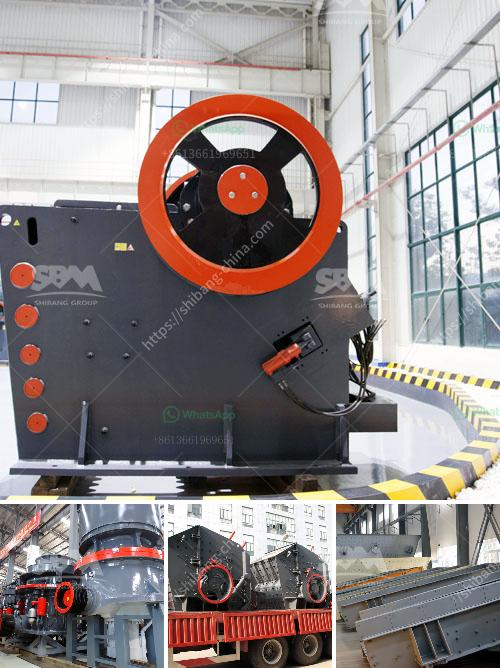

<h3>manufacturer of silica sand cleaning machines in europe</h3>
Silica sand cleaning machines are essential equipment in manufacturing plants and industries that deal with the production and processing of silica sand. Silica sand is widely used in various applications such as glass manufacturing, ceramics, foundry, construction, and chemical production. However, the raw silica sand harvested from mines and quarries contains impurities such as clay, silt, and other organic matter that need to be removed to meet quality standards.

Europe is home to several leading manufacturers of silica sand cleaning machines that cater to the growing demand for clean and purified silica sand. These manufacturers develop innovative and advanced equipment to efficiently clean and process silica sand, ensuring high-quality end products for their customers.

One prominent manufacturer of silica sand cleaning machines in Europe is ABC Company. With over two decades of experience in the industry, ABC Company has established itself as a reliable and trustworthy supplier of silica sand cleaning machines. Their range of products includes various models that cater to different capacities and requirements of customers.

ABC Company's silica sand cleaning machines are designed with advanced technology and automation features, making the cleaning process more efficient and user-friendly. The machines are equipped with high-pressure water jets, vibrating screens, and various separation techniques to remove impurities and ensure a clean final product. Additionally, ABC Company incorporates eco-friendly features in their machines, such as water recycling systems, to minimize water consumption and environmental impact.

Another notable manufacturer in Europe is XYZ Industries. XYZ Industries specializes in developing customized silica sand cleaning machines tailored to meet specific customer requirements. They work closely with clients, understanding their production needs and challenges to design and manufacture machines that optimize efficiency and productivity.

XYZ Industries' silica sand cleaning machines are known for their robust construction and reliability. The machines undergo rigorous testing and quality control measures to ensure the highest standards are met. Moreover, XYZ Industries provides excellent after-sales support, including maintenance, spare parts, and technical assistance, to ensure uninterrupted operation of their equipment.

The demand for silica sand cleaning machines in Europe is driven by the increasing awareness about the importance of high-quality silica sand in various industries. Manufacturers are continually investing in research and development to improve the efficiency and performance of their machines, as well as exploring sustainable solutions to minimize environmental impact.

In conclusion, the manufacturers of silica sand cleaning machines in Europe play a crucial role in ensuring the availability of clean and purified silica sand for industries. These manufacturers develop innovative and technologically advanced equipment that efficiently removes impurities, delivering high-quality silica sand for different applications. With their commitment to quality and customer satisfaction, European manufacturers are well-positioned to meet the growing demand for silica sand cleaning machines.
<h3>Contact us</h3><ul><li><strong>Whatsapp:&nbsp;<a href="https://wa.me/8613661969651">+8613661969651</a></strong></li><li><a href="https://swt.shibang-china.com/?git&amp;zhl&amp;manufacturer of silica sand cleaning machines in europe"><strong>Online Service(chat now)</strong></a></li></ul><h3>Related</h3><ul><li><a href='screen mobile crusher.md'>screen mobile crusher</a></li><li><a href='conventional hammer mill.md'>conventional hammer mill</a></li><li><a href='chrome washing plant for sale south africa.md'>chrome washing plant for sale south africa</a></li><li><a href='mobile crusher for sale in south africa.md'>mobile crusher for sale in south africa</a></li><li><a href='small scale gold ball mill.md'>small scale gold ball mill</a></li></ul>