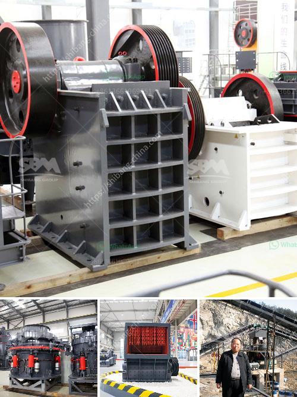

<h3>manufacturer of slag roller crusher in philippines</h3>
The Philippines is known for its rich resources in minerals. According to the Mines and Geosciences Bureau (MGB), the country is ranked top five in the world for minerals such as gold, nickel, copper, and chromite. With such a vast amount of resources, it is no wonder that the country has a booming mining industry.

One essential equipment in the mining industry is the slag roller crusher, which is used to crush and grind the materials. It is commonly used in various production processes, including cement manufacturing, power generation, and steel-making.

In the Philippines, there are several manufacturers of slag roller crushers. One of them is a well-known machinery manufacturer based in Luoyang, China. With over 60 years of experience in the industry, they have developed advanced technology to produce high-quality crushers.

Their slag roller crushers are designed to crush materials with high temperature and pressure, resulting in the formation of slag. The equipment is made with wear-resistant materials to endure the harsh conditions of mining operations. It also has a low-noise design, which reduces the sound produced during the crushing process, making it more operator-friendly.

Moreover, the manufacturer provides customized solutions to meet the specific requirements of different clients. They offer a range of sizes and capacities, ensuring that their crushers can be used in various mining applications. Additionally, they have a comprehensive after-sales service, including training, installation, and maintenance support.

In conclusion, the manufacturer of slag roller crushers in the Philippines plays a crucial role in the country's mining industry. Their high-quality equipment helps to extract valuable minerals efficiently. With their advanced technology and excellent after-sales service, they continue to contribute to the growth and development of the mining sector in the Philippines.
<h3>Contact us</h3><ul><li><strong>Whatsapp:&nbsp;<a href="https://wa.me/8613661969651">+8613661969651</a></strong></li><li><a href="https://swt.shibang-china.com/?git&amp;zhl&amp;manufacturer of slag roller crusher in philippines"><strong>Online Service(chat now)</strong></a></li></ul><h3>Related</h3><ul><li><a href='vsi crusher machine.md'>vsi crusher machine</a></li><li><a href='crawler mobile jaw crusher for sale.md'>crawler mobile jaw crusher for sale</a></li><li><a href='stone crusher uganda.md'>stone crusher uganda</a></li><li><a href='quote for cone crusher.md'>quote for cone crusher</a></li><li><a href='mobile dimension stone processing.md'>mobile dimension stone processing</a></li></ul>