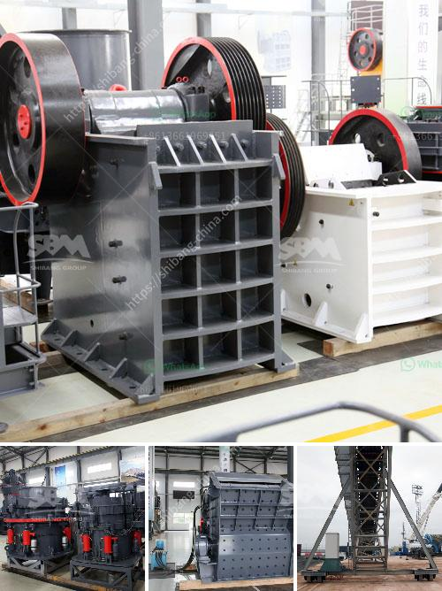

<h3>manufacturers of mobile crushing plants</h3>
Mobile crushing plants are essential for the construction industry, offering efficient crushing and screening of a wide variety of materials such as concrete, brick, rock, stone, limestone, sandstone, and more. These versatile plants are capable of producing aggregates in various sizes at high production rates, while minimizing operational costs and environmental impact.

Manufacturers of mobile crushing plants play a crucial role in meeting the demands of construction industries worldwide. They design, engineer, and manufacture high-quality mobile crushers that deliver superior performance and durability. From small-scale contractors to large mining operations, these crushing plants are relied upon for efficient and reliable crushing of materials on-site.

One such manufacturer that excels in the production of mobile crushing plants is [Manufacturer's Name]. With decades of experience in the industry, they have established themselves as a leading provider of highly efficient and reliable mobile crushers. Their extensive range of crushing plants includes models suitable for both recycling and aggregate production, catering to diverse customer needs.

[Manufacturer's Name] utilizes advanced technology and innovative design to ensure their mobile crushing plants stay ahead of the competition. These plants are equipped with powerful engines that provide high crushing forces, enabling efficient reduction of even the toughest materials. Additionally, intelligent control systems are integrated into their crushers, allowing for precise operation and monitoring of various parameters, optimizing performance and reducing downtime.

One of the key advantages of [Manufacturer's Name] mobile crushing plants is their mobility. Designed with convenience in mind, these plants can be easily transported to different locations, making them ideal for on-site crushing projects. Furthermore, they can be quickly set up and dismantled, allowing contractors to move between job sites with ease.

Durability is another prime consideration for [Manufacturer's Name]. Their mobile crushing plants are constructed with high-quality materials and components, ensuring reliable operation and longevity. Robust steel frames and reinforced structures provide stability and support, even during demanding crushing operations. Moreover, the rugged design allows the plants to withstand harsh working conditions, increasing their lifespan and reducing maintenance requirements.

To ensure their mobile crushing plants meet the highest quality standards, [Manufacturer's Name] rigorously tests each unit before it leaves their production facilities. Stringent quality control measures are employed throughout the manufacturing process, ensuring that every component is in perfect working order. These tests also ensure that the plants comply with industry regulations and safety standards, giving customers peace of mind.

In conclusion, manufacturers of mobile crushing plants are crucial in meeting the demands of the construction industry. Their expertise and innovation enable the production of high-quality, efficient, and reliable crushers that cater to diverse customer needs. With advanced technology and a focus on durability and mobility, manufacturers like [Manufacturer's Name] are leading the way in providing cutting-edge mobile crushing solutions for various applications.
<h3>Contact us</h3><ul><li><strong>Whatsapp:&nbsp;<a href="https://wa.me/8613661969651">+8613661969651</a></strong></li><li><a href="https://swt.shibang-china.com/?git&amp;zhl&amp;manufacturers of mobile crushing plants"><strong>Online Service(chat now)</strong></a></li></ul><h3>Related</h3><ul><li><a href='china gold processing mills.md'>china gold processing mills</a></li><li><a href='diamond plant for sale in south africa.md'>diamond plant for sale in south africa</a></li><li><a href='gypsum recycling plant.md'>gypsum recycling plant</a></li><li><a href='prices of stone crusher in dubai.md'>prices of stone crusher in dubai</a></li><li><a href='mining equipments in japan.md'>mining equipments in japan</a></li></ul>